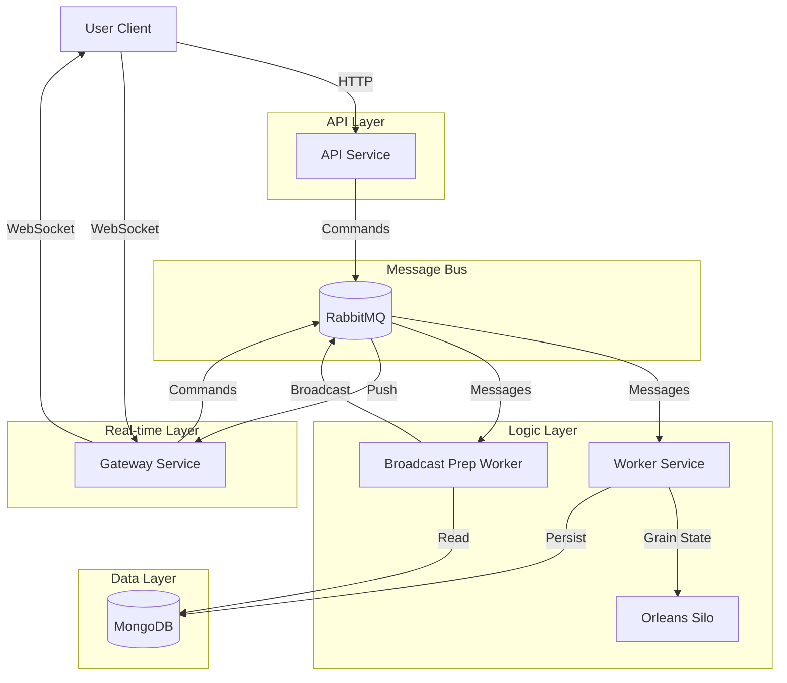

# Global System Architecture

This document provides a deep-dive analysis of the **ChatSystem** architecture, a high-performance, distributed, real-time messaging platform.

## 1. Architectural Overview

The system follows a **Microservices Architecture** combined with **Event-Driven Architecture (EDA)** and the **Actor Model** (via Microsoft Orleans). This combination ensures high availability, horizontal scalability, and efficient real-time state management.

### Core Architectural Pillars:
- **Stateless Microservices**: Most services are stateless, allowing for easy horizontal scaling.
- **Asynchronous Messaging**: Communication between services is primarily handled via **MassTransit** over **RabbitMQ**, ensuring loose coupling and resilience.
- **Distributed State Management**: **Microsoft Orleans** is used to manage "Grains" (Virtual Actors), providing a high-performance way to handle entity states (like chat ACK tracking) in memory across a cluster.
- **Real-Time Communication**: **WebSockets** are used for bi-directional communication between clients and the system, managed by a dedicated **Gateway** service.
- **Polyglot Persistence**: While primarily using **MongoDB**, the system is designed to allow different storage engines for different services if needed.

---

## 2. Microservices Analysis

### 2.1 API Service (`Api`)
- **Purpose**: Acts as the RESTful entry point for client applications.
- **Responsibilities**:
    - User Authentication & Authorization (JWT).
    - User Profile & Contact Management.
    - Chat & Group Creation.
    - Snapshot Retrieval (Initial state sync).
- **Tech Stack**: ASP.NET Core, MediatR (CQRS), MongoDB.
- **Interactions**: Persists data directly to MongoDB; issues commands to the event bus for side effects.

### 2.2 Gateway Service (`Gateway`)
- **Purpose**: Manages long-lived WebSocket connections and WebRTC signaling.
- **Responsibilities**:
    - WebSocket Lifecycle Management (Connect/Disconnect).
    - Ingress Message Handling (Translating WS messages to Event Bus commands).
    - Egress Message Broadcasting (Delivering messages from the Event Bus to specific sockets).
    - **WebRTC Signaling**: Handling `offer`, `answer`, `ice-candidate`, and `call-join` logic.
- **Internal Modules**: `WebSocketMiddleware`, `GatewayIngressHandler`, `BroadcastManager`, `ConnectionStoreManager`.
- **Interactions**: Publishes commands to the Worker; consumes broadcast commands from the Event Bus.

### 2.3 Worker Service (`Worker`)
- **Purpose**: The "Brain" of the system, handling business logic, state, and persistence.
- **Responsibilities**:
    - Message Persistence (Saving messages to MongoDB).
    - **ACK Tracking**: Using **Orleans Grains** (`ChatGrain`) to track delivery and seen status using bitmasks for extreme efficiency.
    - Call State Management (Tracking active sessions).
    - Member Management logic.
- **Tech Stack**: Microsoft Orleans, MassTransit, MongoDB.
- **Interactions**: Consumes commands from the Gateway and API; publishes events (e.g., `MessageCreatedEvent`) for further processing.

### 2.4 Broadcast Preparation Worker (`BroadcastPreparationWorker`)
- **Purpose**: Pre-processes events before they are sent back to the Gateway for delivery.
- **Responsibilities**:
    - **Fan-out Preparation**: Determining which users need to receive a specific message.
    - **Snapshot Updates**: Updating the "last message" snapshot for all participants in a chat.
    - **Broadcast Command Generation**: Publishing specific `BroadcastMessageCommand` for the Gateway.
- **Internal Modules**: `EventPipeline` (a chain-of-responsibility pattern for event processing).
- **Interactions**: Consumes `MessageCreatedEvent`; publishes `BroadcastMessageCommand` and `UpdateChatSnapshotCommand`.

---

## 3. Microservices Dependency Map

---

## 4. Technology Stack

| Component | Technology | Role |
|-----------|------------|------|
| **Backend Framework** | .NET 8.0 / 9.0 | Core runtime for all services. |
| **Real-time** | WebSockets | Low-latency bi-directional communication. |
| **Communication** | MassTransit + RabbitMQ | Reliable, asynchronous service-to-service messaging. |
| **State Management** | Microsoft Orleans | Distributed Virtual Actor model for high-concurrency state. |
| **Database** | MongoDB | Document store for messages, users, and chat metadata. |
| **WebRTC Signaling** | Custom Gateway logic | Orchestrating P2P connections and group calls. |
| **Serialization** | MessagePack & JSON | High-performance binary and text serialization. |
| **Auth** | JWT (JSON Web Tokens) | Secure stateless authentication. |

---

## 5. Database Design & Entities

The system uses **MongoDB** as its primary store.

### Core Entities:
- **AppUser**: User profiles, credentials (hashed), status, and metadata.
- **Chat**: Chat metadata, type (Direct/Group), and member list.
- **Message**: The core message object.
    - *Optimization*: Messages include `clientMessageId` for idempotency and `SentAt` for ordering.
    - *Attachments*: Embedded list of media objects.
- **ChatSnapshot**: A specialized collection that stores the "last message" and unread count per user/chat pair, enabling fast UI rendering of the chat list.
- **Orleans States**: `ChatGrainState` stores ACK bitmasks and participant indices.

### Indexing Strategy:
- **Messages**: Indexed by `ChatId` and `SentAt`.
- **Snapshots**: Indexed by `UserId` and `LastModified`.
- **Users**: Indexed by `Email` and `Username`.

---

## 6. Event System & Reliability

The system uses an **Event-Driven Architecture** with several patterns to ensure reliability:

- **Retries**: MassTransit is configured with retry policies for transient failures.
- **Dead Letter Queues (DLQ)**: Failed messages are moved to DLQs (e.g., `call-worker-dlq`) for inspection and manual replay.
- **Outbox Pattern**: Implemented to ensure that database updates and event publishing are atomic.
- **ACK Bitmasking**: In `ChatGrain`, message delivery status is tracked using a bitmask. For a group of 100 people, instead of 100 rows in a DB, it's a few bytes in a bitmask, drastically reducing I/O.

---

## 7. Security Review

- **Authentication**: JWT tokens are required for all API calls and to establish WebSocket connections.
- **Authorization**: Role-based and ownership-based checks (e.g., only members of a group can send messages to it).
- **Data Protection**: BCrypt with a high work factor for passwords.
- **Service-to-Service**: Currently relies on internal network security; can be extended with mTLS or shared secrets in `appsettings`.

---

## 8. Scalability Analysis

- **Horizontal Scaling**:
    - **Gateway**: Multiple instances can run behind a Load Balancer. Since state is in Orleans/Redis/MongoDB, any Gateway can handle any user.
    - **Workers**: Can be scaled horizontally. Orleans handles the placement of Grains automatically across the cluster.
- **Statelessness**: All services except the Orleans Silos (which handle state gracefully) are stateless.
- **Backpressure**: RabbitMQ acts as a buffer, preventing the Worker from being overwhelmed during traffic spikes.

---

## 9. System Architecture Diagram (Mermaid)

---

## 10. Production Readiness & Future Improvements

### Strengths:
- Robust event-driven core.
- Highly efficient ACK tracking via Orleans.
- Clear separation of concerns.

### Weaknesses:
- **Centralized Database**: MongoDB could become a bottleneck; consider sharding.
- **Observability**: Needs integrated Prometheus/Grafana or ELK stack for production monitoring.

### Future Improvements:
- **Caching**: Introduce Redis for faster session and configuration lookups.
- **Rate Limiting**: Implement Global Rate Limiting at the Gateway level.
- **Media Optimization**: CDN integration for message attachments.
