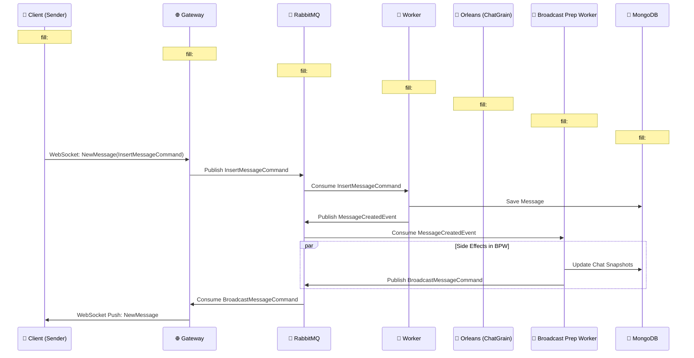
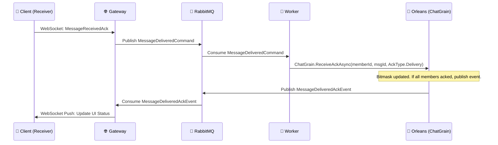
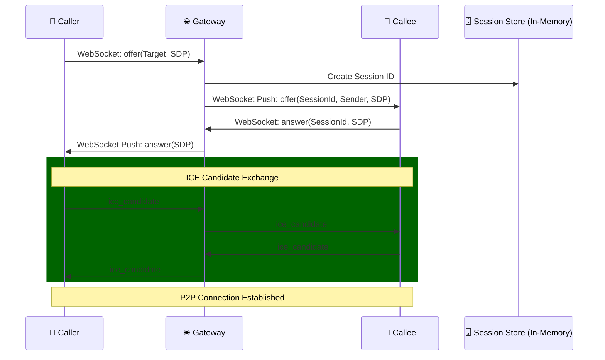
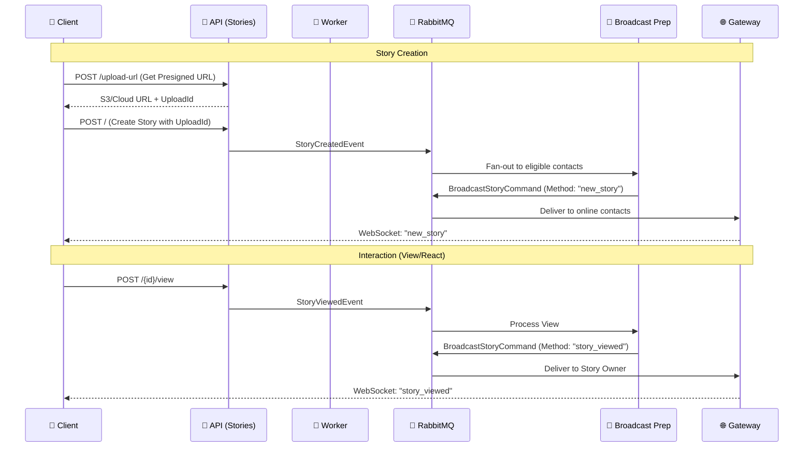

# System Features & Flows

This document details all the features implemented in the **ChatSystem** and provides step-by-step execution flows for the most critical operations.

---

## 1. Feature Discovery

### 1.1 Messaging Features
- **Real-time Messaging**: Bi-directional message exchange over WebSockets.
- **Message Persistence**: All messages are stored in MongoDB.
- **Media Attachments**: Support for images/files with metadata (size, dimensions, duration).
- **Message Reply**: References to previous messages.
- **Message Forwarding**: Re-publishing existing messages to new chats.
- **Message Status Tracking**:
    - **Sent**: Message recorded in DB.
    - **Delivered**: Receiver client acknowledged receipt.
    - **Seen**: Receiver client marked message as read.
- **Idempotency**: `clientMessageId` handling to prevent duplicate messages during retries.

### 1.2 Chat & Presence Features
- **Direct Messaging**: One-on-one chats.
- **Group Chats**: Multi-participant conversations.
- **Chat Snapshots**: Per-user localized view of chats (last message, unread count).
- **Presence System**: Real-time online/offline status tracking.
- **Typing Indicators**: Real-time notifications when a user is typing (implemented via `UserStateMethodHndler`).

### 1.3 Stories Features (WhatsApp-like)
- **Status Updates**: Post text, photo, or video stories that expire after 24 hours.
- **Story Interaction**:
    - **Views**: Track who viewed your story and for how long.
    - **Reactions**: Send emoji reactions to stories.
    - **Replies**: Reply to stories (converts to a direct message).
- **Privacy Controls**:
    - **Everyone**: Visible to all users.
    - **My Contacts**: Visible only to added contacts.
    - **My Contacts Except...**: Exclude specific contacts.
    - **Only Share With...**: Share with a selected whitelist.
- **Media Management**: Presigned URL uploads for high-performance media handling.
- **Story Feed**: Aggregated view of recent stories from contacts.
- **Auto-Cleanup**: Background worker automatically removes expired stories and their media.

### 1.4 WebRTC Signaling Features
- **P2P Video/Voice Calls**: Direct calls between two users.
- **Group Calls**: Multi-user calls with a central session.
- **Signaling Exchange**:
    - **Offer/Answer**: SDP exchange for WebRTC peer connection.
    - **ICE Candidates**: Network path discovery signals.
- **Call Session Management**:
    - **Ring Timeout**: Calls auto-cancel if not answered within 30 seconds.
    - **Active Call Guard**: Prevents creating multiple calls for the same chat.
    - **Call Join/Leave**: Managing participants in a session.
- **Media State**: Synchronizing mute/unmute and camera on/off states.

---

## 2. Core Execution Flows

### 2.1 Chat Message Flow

### 2.2 Message ACK Flow (Delivery/Seen)

### 2.3 WebRTC Signaling Flow

### 2.4 Story Lifecycle & Interaction Flow

---

## 3. Implementation Details

### 3.1 ACK Bitmasking (The `ChatGrain`)
The system uses a highly optimized bitmasking approach to track message status in large groups.
- Each member is assigned an `index` in the `ChatGrain`.
- A `byte[]` bitmap is maintained for each message.
- When a user sends an ACK, the bit at their `index` is set to `1`.
- This avoids millions of individual ACK records in the database, storing only the "High Watermark" of ACKs periodically.

### 3.2 Chat Snapshots
Instead of querying the `Messages` collection and joining with `Users` to render the chat list, the system maintains a `ChatSnapshots` collection.
- Every time a message is sent, the `BroadcastPreparationWorker` updates the snapshot for **all** participants.
- The snapshot contains `LastMessageContent`, `LastMessageSender`, and `UnreadCount`.
- Clients query this collection via the `SnapshotsController` for near-instant UI loading.

### 3.3 Ring Timeout logic
In `CreateGroupCallHandler`, when a call starts:
1. A timer is started via `IRingTimeoutService`.
2. If `JoinCallMethodHandler` is called (someone answers), the timer is cancelled.
3. If the timer expires (30s), a `HandleRingTimeoutAsync` cleanup runs, removing the session and notifying participants of a "Missed Call".
