# 🚀 Chat Gateway — Architecture & Features

> WebSocket Gateway built with **ASP.NET Core**, **Orleans**, **MassTransit/RabbitMQ**, and **MessagePack**

---

## 📋 Table of Contents

1. [System Overview](#1-system-overview)
2. [WebSocket Connection Flow](#2-websocket-connection-flow)
3. [Message Frame Protocol](#3-message-frame-protocol)
4. [Message Pipeline (Middleware Chain)](#4-message-pipeline-middleware-chain)
5. [MessageContext Pattern](#5-messagecontext-pattern)
6. [Handler System](#6-handler-system)
7. [Orleans Grain Architecture](#7-orleans-grain-architecture)
8. [Broadcast & Fan-Out System](#8-broadcast--fan-out-system)
9. [Bug Fixes Applied](#9-bug-fixes-applied)
10. [Clean Architecture Layers](#10-clean-architecture-layers)
11. [Tech Stack](#11-tech-stack)

---

## 1. System Overview

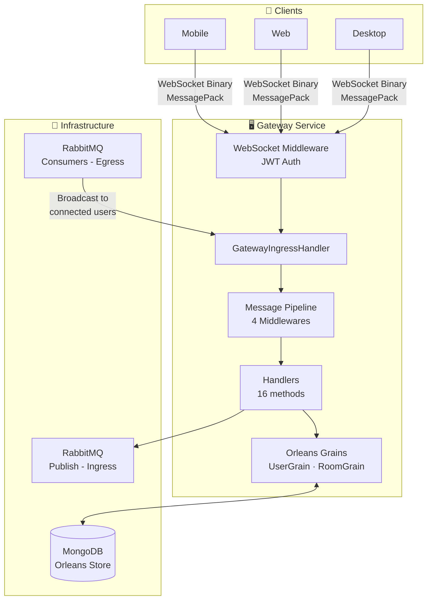
```mermaid
graph TB
    subgraph CLIENTS["📱 Clients"]
        M[Mobile]
        W[Web]
        D[Desktop]
    end

    subgraph GATEWAY["🖥️ Gateway Service"]
        WM[WebSocket Middleware\nJWT Auth]
        GI[GatewayIngressHandler]
        MP[Message Pipeline\n4 Middlewares]
        HD[Handlers\n16 methods]
        OG[Orleans Grains\nUserGrain · RoomGrain]
    end

    subgraph INFRA["🔧 Infrastructure"]
        RQ1[RabbitMQ\nPublish - Ingress]
        MG[(MongoDB\nOrleans Store)]
        RQ2[RabbitMQ\nConsumers - Egress]
    end

    M & W & D -->|WebSocket Binary\nMessagePack| WM
    WM --> GI
    GI --> MP
    MP --> HD
    HD --> OG
    HD --> RQ1
    OG <--> MG
    RQ2 -->|Broadcast to\nconnected users| GI
```

---

## 2. WebSocket Connection Flow

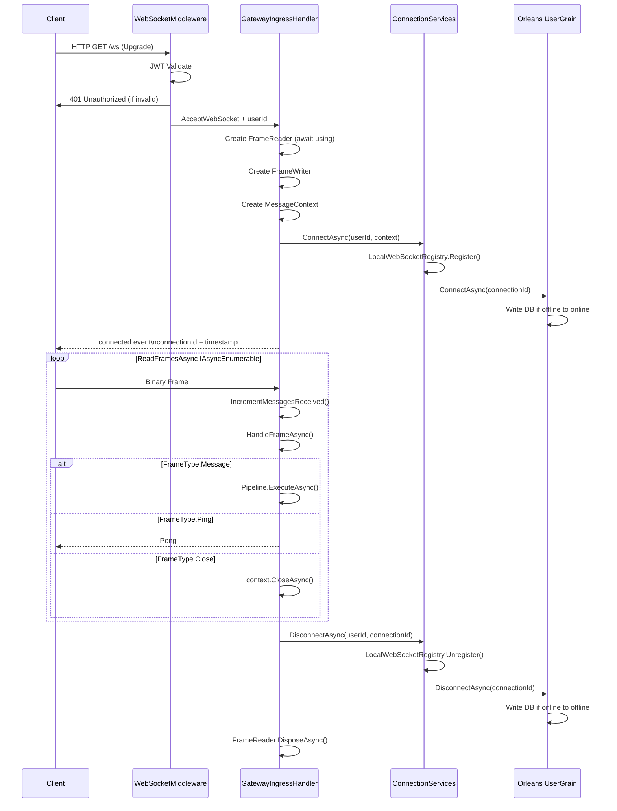
```mermaid
sequenceDiagram
    participant C as Client
    participant MW as WebSocketMiddleware
    participant GI as GatewayIngressHandler
    participant CS as ConnectionServices
    participant OG as Orleans UserGrain

    C->>MW: HTTP GET /ws (Upgrade)
    MW->>MW: JWT Validate
    MW->>C: 401 Unauthorized (if invalid)
    MW->>GI: AcceptWebSocket + userId

    GI->>GI: Create FrameReader (await using)
    GI->>GI: Create FrameWriter
    GI->>GI: Create MessageContext

    GI->>CS: ConnectAsync(userId, context)
    CS->>CS: LocalWebSocketRegistry.Register()
    CS->>OG: ConnectAsync(connectionId)
    OG->>OG: Write DB if offline to online

    GI-->>C: connected event\nconnectionId + timestamp

    loop ReadFramesAsync IAsyncEnumerable
        C->>GI: Binary Frame
        GI->>GI: IncrementMessagesReceived()
        GI->>GI: HandleFrameAsync()

        alt FrameType.Message
            GI->>GI: Pipeline.ExecuteAsync()
        else FrameType.Ping
            GI-->>C: Pong
        else FrameType.Close
            GI->>GI: context.CloseAsync()
        end
    end

    GI->>CS: DisconnectAsync(userId, connectionId)
    CS->>CS: LocalWebSocketRegistry.Unregister()
    CS->>OG: DisconnectAsync(connectionId)
    OG->>OG: Write DB if online to offline
    GI->>GI: FrameReader.DisposeAsync()
```

---

## 3. Message Frame Protocol

### Frame Types

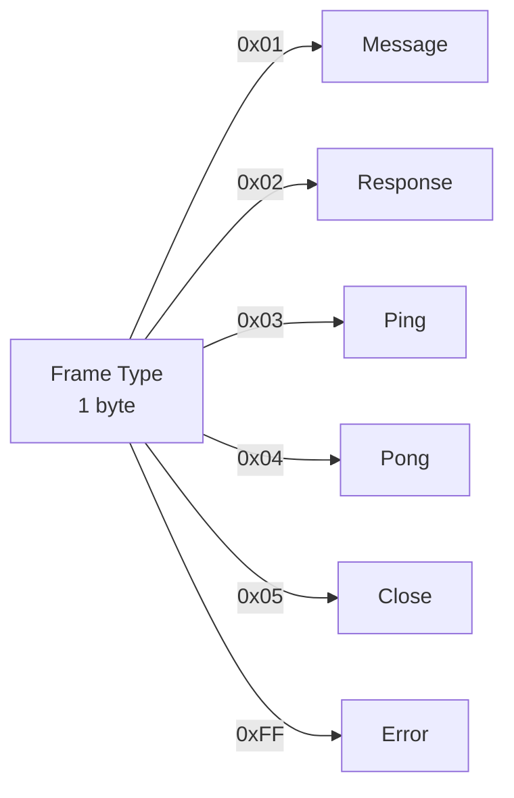
```mermaid
flowchart LR
    FT["Frame Type\n1 byte"]
    FT -->|0x01| MSG[Message]
    FT -->|0x02| RES[Response]
    FT -->|0x03| PIN[Ping]
    FT -->|0x04| PON[Pong]
    FT -->|0x05| CLO[Close]
    FT -->|0xFF| ERR[Error]
```

### FrameReader — Pipeline Flow

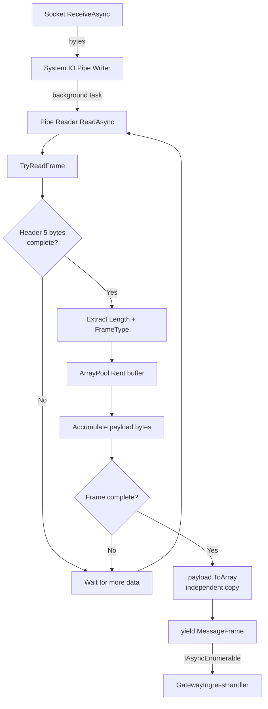
```mermaid
flowchart TD
    S[Socket.ReceiveAsync] -->|bytes| P[System.IO.Pipe Writer]
    P -->|background task| R[Pipe Reader ReadAsync]
    R --> TRF[TryReadFrame]

    TRF --> H{Header 5 bytes\ncomplete?}
    H -->|No| W[Wait for more data]
    W --> R

    H -->|Yes| EX[Extract Length + FrameType]
    EX --> RB[ArrayPool.Rent buffer]
    RB --> AC[Accumulate payload bytes]
    AC --> FC{Frame complete?}
    FC -->|No| W
    FC -->|Yes| CP[payload.ToArray\nindependent copy]
    CP --> YF[yield MessageFrame]
    YF -->|IAsyncEnumerable| GI[GatewayIngressHandler]
```

---

## 4. Message Pipeline (Middleware Chain)

### Pipeline Execution Order

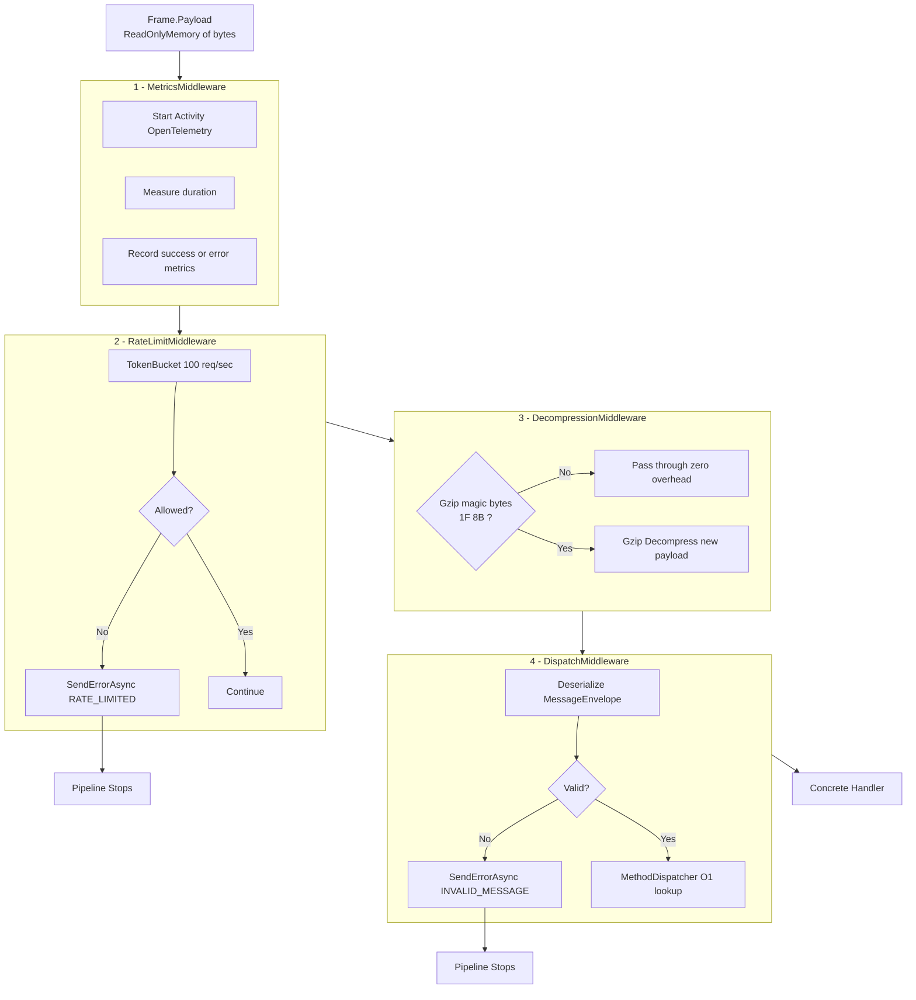
```mermaid
flowchart TD
    F[Frame.Payload\nReadOnlyMemory of bytes]

    F --> M1

    subgraph M1["1 - MetricsMiddleware"]
        MA[Start Activity OpenTelemetry]
        MB[Measure duration]
        MC[Record success or error metrics]
    end

    M1 --> M2

    subgraph M2["2 - RateLimitMiddleware"]
        RA[TokenBucket 100 req/sec]
        RB{Allowed?}
        RC[SendErrorAsync RATE_LIMITED]
        RD[Continue]
        RA --> RB
        RB -->|No| RC
        RB -->|Yes| RD
    end

    RC --> STOP1[Pipeline Stops]
    M2 --> M3

    subgraph M3["3 - DecompressionMiddleware"]
        DA{Gzip magic bytes\n1F 8B ?}
        DB[Pass through zero overhead]
        DC[Gzip Decompress new payload]
        DA -->|No| DB
        DA -->|Yes| DC
    end

    M3 --> M4

    subgraph M4["4 - DispatchMiddleware"]
        PA[Deserialize MessageEnvelope]
        PB{Valid?}
        PC[SendErrorAsync INVALID_MESSAGE]
        PD[MethodDispatcher O1 lookup]
        PA --> PB
        PB -->|No| PC
        PB -->|Yes| PD
    end

    PC --> STOP2[Pipeline Stops]
    M4 --> H[Concrete Handler]
```

### كيف بيتبنى الـ Pipeline

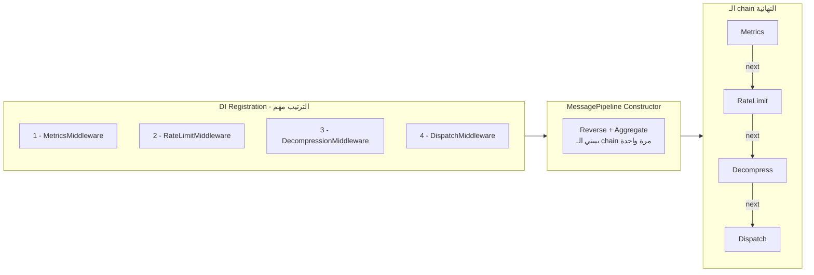
```mermaid
flowchart LR
    subgraph DI["DI Registration - الترتيب مهم"]
        D1[1 - MetricsMiddleware]
        D2[2 - RateLimitMiddleware]
        D3[3 - DecompressionMiddleware]
        D4[4 - DispatchMiddleware]
    end

    subgraph BUILD["MessagePipeline Constructor"]
        AG[Reverse + Aggregate\nبيبني الـ chain مرة واحدة]
    end

    subgraph CHAIN["الـ chain النهائية"]
        C1[Metrics] -->|next| C2[RateLimit] -->|next| C3[Decompress] -->|next| C4[Dispatch]
    end

    DI --> BUILD --> CHAIN
```

---

## 5. MessageContext Pattern

### قبل وبعد

```mermaid
flowchart TD
    subgraph BEFORE["قبل - userId + socket منفصلين في كل حاجة"]
        B1["GatewayIngressHandler(userId, socket)"]
        B2["Dispatcher(userId, method, params, socket)"]
        B3["IMethodHandler.Handle(userId, data, socket)"]
        B4["HandleAsync(userId, T, socket)"]
        B1 --> B2 --> B3 --> B4
    end

    subgraph AFTER["بعد - MessageContext يتمرر في كل الـ chain"]
        A1["GatewayIngressHandler(userId, socket)"]
        A2["CREATE MessageContext هنا بس"]
        A3["Pipeline.ExecuteAsync(context, payload)"]
        A4["IMethodHandler.Handle(context, data)"]
        A5["HandleAsync(context, T)"]
        A6["context.UserId\ncontext.SendResponseAsync()\ncontext.ConnectionId\ncontext.MessagesReceived"]
        A1 --> A2 --> A3 --> A4 --> A5 --> A6
    end
```

### محتوى MessageContext

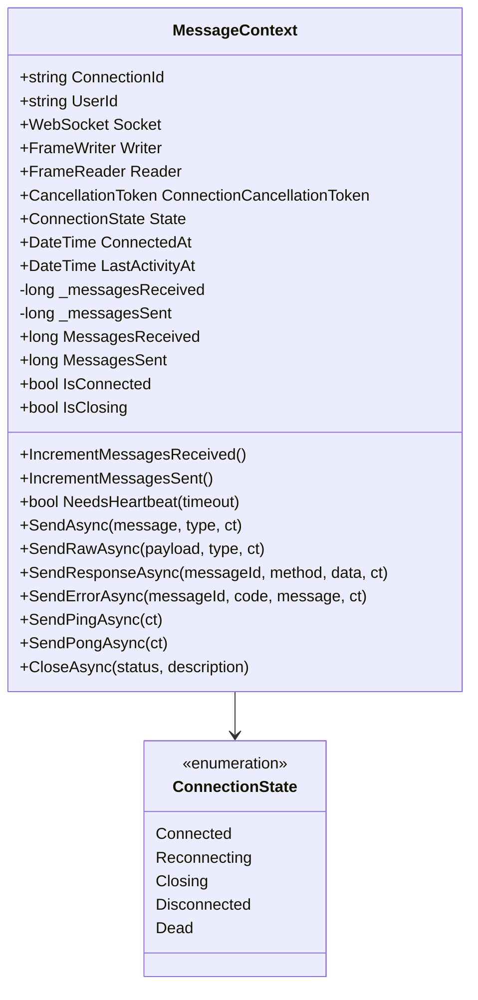
```mermaid
classDiagram
    class MessageContext {
        +string ConnectionId
        +string UserId
        +WebSocket Socket
        +FrameWriter Writer
        +FrameReader Reader
        +CancellationToken ConnectionCancellationToken
        +ConnectionState State
        +DateTime ConnectedAt
        +DateTime LastActivityAt
        -long _messagesReceived
        -long _messagesSent
        +long MessagesReceived
        +long MessagesSent
        +IncrementMessagesReceived()
        +IncrementMessagesSent()
        +bool IsConnected
        +bool IsClosing
        +bool NeedsHeartbeat(timeout)
        +SendAsync(message, type, ct)
        +SendRawAsync(payload, type, ct)
        +SendResponseAsync(messageId, method, data, ct)
        +SendErrorAsync(messageId, code, message, ct)
        +SendPingAsync(ct)
        +SendPongAsync(ct)
        +CloseAsync(status, description)
    }

    class ConnectionState {
        <<enumeration>>
        Connected
        Reconnecting
        Closing
        Disconnected
        Dead
    }

    MessageContext --> ConnectionState
```

---

## 6. Handler System

### الـ 16 Handler في 5 Categories

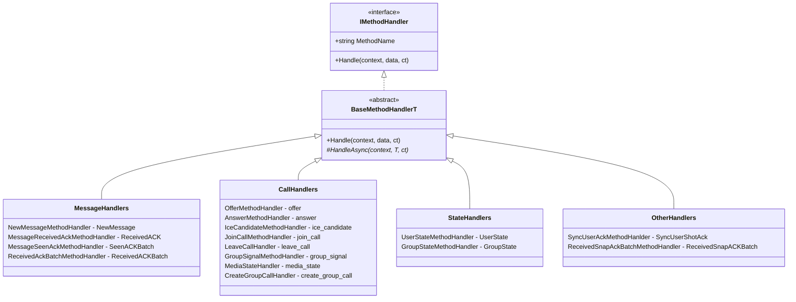
```mermaid
classDiagram
    class IMethodHandler {
        <<interface>>
        +string MethodName
        +Handle(context, data, ct)
    }

    class BaseMethodHandlerT {
        <<abstract>>
        +Handle(context, data, ct)
        #HandleAsync(context, T, ct)*
    }

    class MessageHandlers {
        NewMessageMethodHandler - NewMessage
        MessageReceivedAckMethodHandler - ReceivedACK
        MessageSeenAckMethodHandler - SeenACKBatch
        ReceivedAckBatchMethodHandler - ReceivedACKBatch
    }

    class CallHandlers {
        OfferMethodHandler - offer
        AnswerMethodHandler - answer
        IceCandidateMethodHandler - ice_candidate
        JoinCallMethodHandler - join_call
        LeaveCallHandler - leave_call
        GroupSignalMethodHandler - group_signal
        MediaStateHandler - media_state
        CreateGroupCallHandler - create_group_call
    }

    class StateHandlers {
        UserStateMethodHandler - UserState
        GroupStateMethodHandler - GroupState
    }

    class OtherHandlers {
        SyncUserAckMethodHanlder - SyncUserShotAck
        ReceivedSnapAckBatchMethodHandler - ReceivedSnapACKBatch
    }

    IMethodHandler <|.. BaseMethodHandlerT
    BaseMethodHandlerT <|-- MessageHandlers
    BaseMethodHandlerT <|-- CallHandlers
    BaseMethodHandlerT <|-- StateHandlers
    BaseMethodHandlerT <|-- OtherHandlers
```

### WebRTC Call Flow

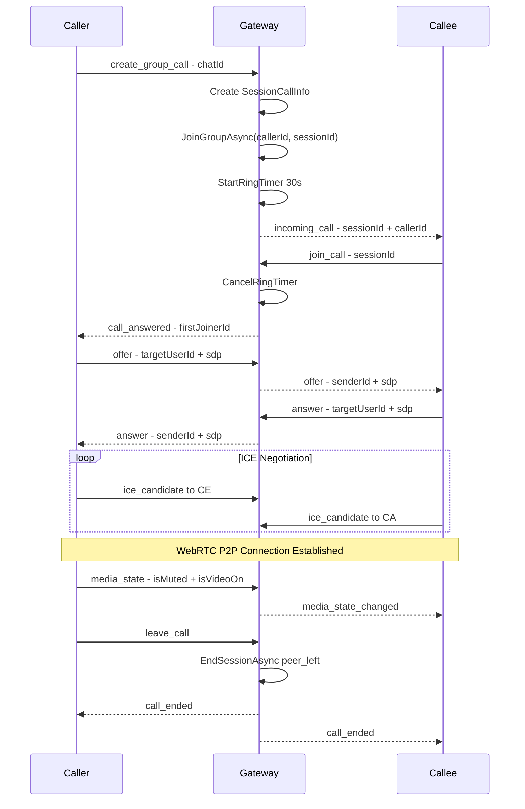
```mermaid
sequenceDiagram
    participant CA as Caller
    participant GW as Gateway
    participant CE as Callee

    CA->>GW: create_group_call - chatId
    GW->>GW: Create SessionCallInfo
    GW->>GW: JoinGroupAsync(callerId, sessionId)
    GW->>GW: StartRingTimer 30s
    GW-->>CE: incoming_call - sessionId + callerId

    CE->>GW: join_call - sessionId
    GW->>GW: CancelRingTimer
    GW-->>CA: call_answered - firstJoinerId

    CA->>GW: offer - targetUserId + sdp
    GW-->>CE: offer - senderId + sdp

    CE->>GW: answer - targetUserId + sdp
    GW-->>CA: answer - senderId + sdp

    loop ICE Negotiation
        CA->>GW: ice_candidate to CE
        CE->>GW: ice_candidate to CA
    end

    Note over CA,CE: WebRTC P2P Connection Established

    CA->>GW: media_state - isMuted + isVideoOn
    GW-->>CE: media_state_changed

    CA->>GW: leave_call
    GW->>GW: EndSessionAsync peer_left
    GW-->>CA: call_ended
    GW-->>CE: call_ended
```

---

## 7. Orleans Grain Architecture

### Grain Design

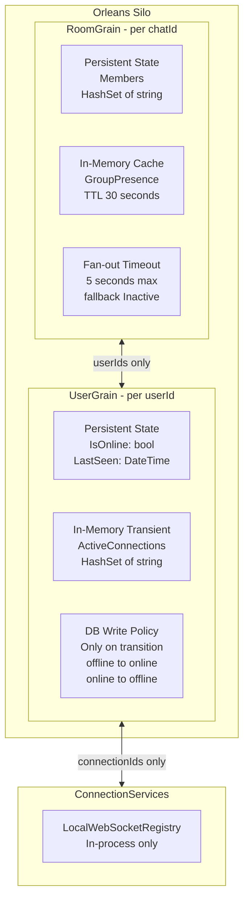
```mermaid
graph TB
    subgraph SILO["Orleans Silo"]
        subgraph UG["UserGrain - per userId"]
            UPS["Persistent State\nIsOnline: bool\nLastSeen: DateTime"]
            UTR["In-Memory Transient\nActiveConnections\nHashSet of string"]
            UDB["DB Write Policy\nOnly on transition\noffline to online\nonline to offline"]
        end

        subgraph RG["RoomGrain - per chatId"]
            RPS["Persistent State\nMembers\nHashSet of string"]
            RCA["In-Memory Cache\nGroupPresence\nTTL 30 seconds"]
            RTO["Fan-out Timeout\n5 seconds max\nfallback Inactive"]
        end
    end

    subgraph CS["ConnectionServices"]
        LWR["LocalWebSocketRegistry\nIn-process only"]
    end

    UG <-->|connectionIds only| CS
    RG <-->|userIds only| UG
```

### UserGrain — State Transitions

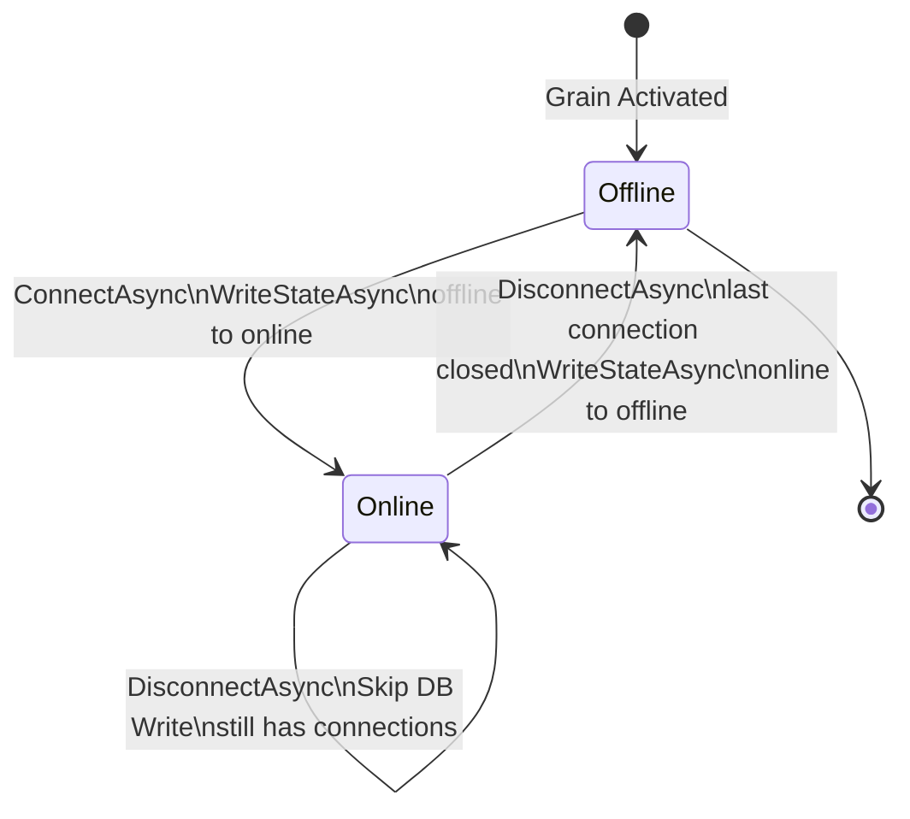
```mermaid
stateDiagram-v2
    [*] --> Offline: Grain Activated

    Offline --> Online: ConnectAsync\nWriteStateAsync\noffline to online

    Online --> Online: ConnectAsync\nSkip DB Write\nalready online

    Online --> Online: DisconnectAsync\nSkip DB Write\nstill has connections

    Online --> Offline: DisconnectAsync\nlast connection closed\nWriteStateAsync\nonline to offline

    Offline --> [*]
```

### RoomGrain — Presence Cache

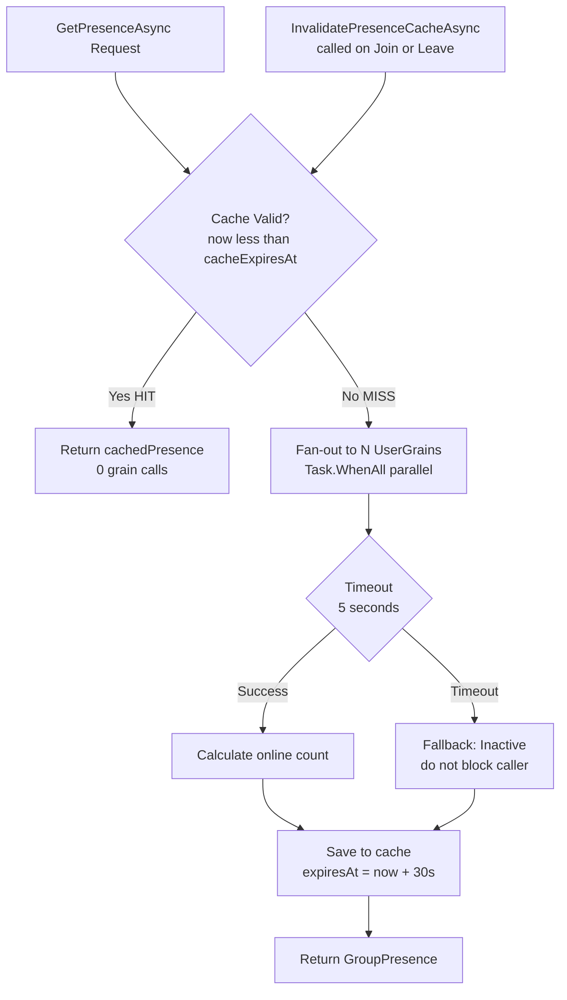
```mermaid
flowchart TD
    REQ[GetPresenceAsync Request]

    REQ --> CC{Cache Valid?\nnow less than cacheExpiresAt}

    CC -->|Yes HIT| RET[Return cachedPresence\n0 grain calls]

    CC -->|No MISS| FO[Fan-out to N UserGrains\nTask.WhenAll parallel]

    FO --> TO{Timeout\n5 seconds}

    TO -->|Success| CALC[Calculate online count]
    TO -->|Timeout| FALL[Fallback: Inactive\ndo not block caller]

    CALC --> SAVE[Save to cache\nexpiresAt = now + 30s]
    FALL --> SAVE

    SAVE --> RET2[Return GroupPresence]

    INV[InvalidatePresenceCacheAsync\ncalled on Join or Leave] --> CC
```

---

## 8. Broadcast & Fan-Out System

### Flow من RabbitMQ للـ Client

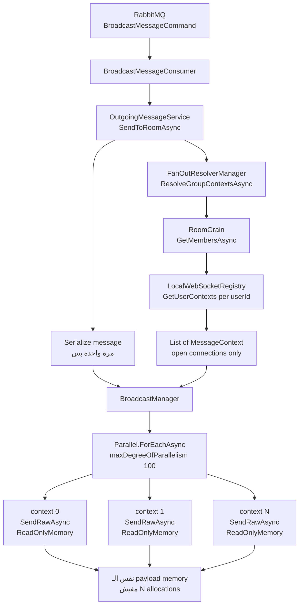
```mermaid
flowchart TD
    RMQ[RabbitMQ\nBroadcastMessageCommand]

    RMQ --> BC[BroadcastMessageConsumer]
    BC --> OMS[OutgoingMessageService\nSendToRoomAsync]

    OMS --> SER[Serialize message\nمرة واحدة بس]
    OMS --> FO[FanOutResolverManager\nResolveGroupContextsAsync]

    FO --> RG[RoomGrain\nGetMembersAsync]
    RG --> LWR[LocalWebSocketRegistry\nGetUserContexts per userId]
    LWR --> CTX[List of MessageContext\nopen connections only]

    SER --> BM[BroadcastManager]
    CTX --> BM

    BM --> PA[Parallel.ForEachAsync\nmaxDegreeOfParallelism 100]

    PA --> C1[context 0\nSendRawAsync\nReadOnlyMemory]
    PA --> C2[context 1\nSendRawAsync\nReadOnlyMemory]
    PA --> CN[context N\nSendRawAsync\nReadOnlyMemory]

    C1 & C2 & CN --> NOTE[نفس الـ payload memory\nمفيش N allocations]
```

### Egress Consumers

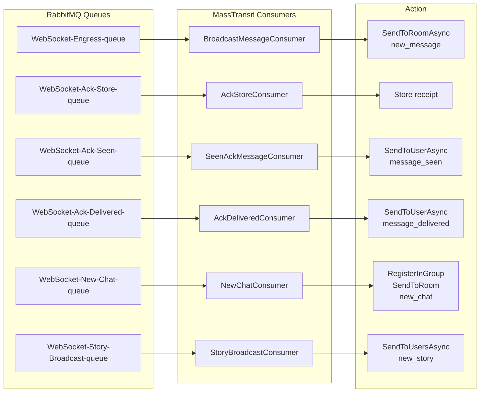
```mermaid
graph LR
    subgraph QUEUES["RabbitMQ Queues"]
        Q1[WebSocket-Engress-queue]
        Q2[WebSocket-Ack-Store-queue]
        Q3[WebSocket-Ack-Seen-queue]
        Q4[WebSocket-Ack-Delivered-queue]
        Q5[WebSocket-New-Chat-queue]
        Q6[WebSocket-Story-Broadcast-queue]
    end

    subgraph CONSUMERS["MassTransit Consumers"]
        C1[BroadcastMessageConsumer]
        C2[AckStoreConsumer]
        C3[SeenAckMessageConsumer]
        C4[AckDeliveredConsumer]
        C5[NewChatConsumer]
        C6[StoryBroadcastConsumer]
    end

    subgraph ACTIONS["Action"]
        A1[SendToRoomAsync\nnew_message]
        A2[Store receipt]
        A3[SendToUserAsync\nmessage_seen]
        A4[SendToUserAsync\nmessage_delivered]
        A5[RegisterInGroup\nSendToRoom\nnew_chat]
        A6[SendToUsersAsync\nnew_story]
    end

    Q1 --> C1 --> A1
    Q2 --> C2 --> A2
    Q3 --> C3 --> A3
    Q4 --> C4 --> A4
    Q5 --> C5 --> A5
    Q6 --> C6 --> A6
```

---

## 9. Bug Fixes Applied

### Fix 1 — Memory Corruption في FrameReader

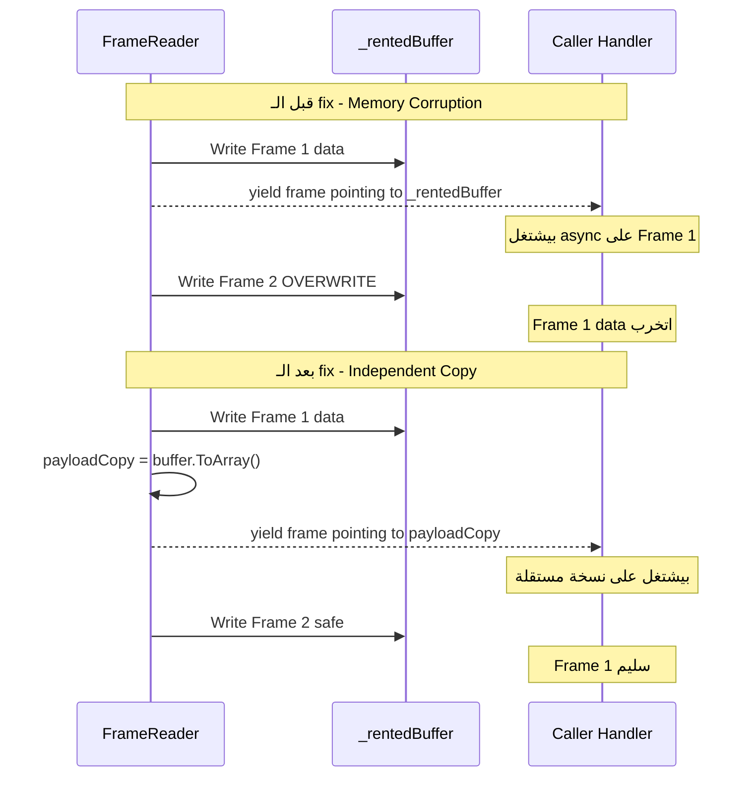
```mermaid
sequenceDiagram
    participant FR as FrameReader
    participant BUF as _rentedBuffer
    participant CA as Caller Handler

    Note over FR,CA: قبل الـ fix - Memory Corruption

    FR->>BUF: Write Frame 1 data
    FR-->>CA: yield frame pointing to _rentedBuffer
    Note over CA: بيشتغل async على Frame 1
    FR->>BUF: Write Frame 2 OVERWRITE
    Note over CA: Frame 1 data اتخرب

    Note over FR,CA: بعد الـ fix - Independent Copy

    FR->>BUF: Write Frame 1 data
    FR->>FR: payloadCopy = buffer.ToArray()
    FR-->>CA: yield frame pointing to payloadCopy
    Note over CA: بيشتغل على نسخة مستقلة
    FR->>BUF: Write Frame 2 safe
    Note over CA: Frame 1 سليم
```

### Fix 2 — FrameReader Memory Leak

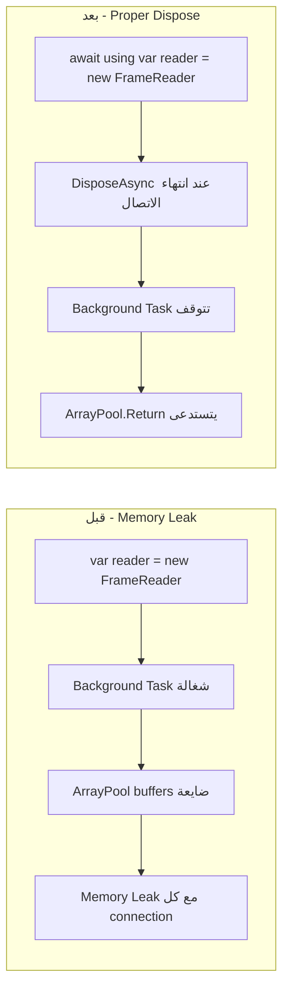
```mermaid
flowchart LR
    subgraph BEFORE["قبل - Memory Leak"]
        B1[var reader = new FrameReader]
        B2[Background Task شغالة]
        B3[ArrayPool buffers ضايعة]
        B4[Memory Leak مع كل connection]
        B1 --> B2 --> B3 --> B4
    end

    subgraph AFTER["بعد - Proper Dispose"]
        A1[await using var reader = new FrameReader]
        A2[DisposeAsync عند انتهاء الاتصال]
        A3[Background Task تتوقف]
        A4[ArrayPool.Return يتستدعى]
        A1 --> A2 --> A3 --> A4
    end
```

### Fix 3 — Double Serialization في Broadcast

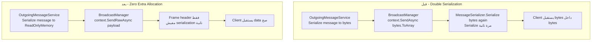
```mermaid
flowchart TD
    subgraph BEFORE["قبل - Double Serialization"]
        B1[OutgoingMessageService\nSerialize message to bytes]
        B2[BroadcastManager\ncontext.SendAsync bytes.ToArray]
        B3[MessageSerializer.Serialize bytes again\nSerialize مرة تانية]
        B4[Client يستقبل bytes داخل bytes]
        B1 --> B2 --> B3 --> B4
    end

    subgraph AFTER["بعد - Zero Extra Allocation"]
        A1[OutgoingMessageService\nSerialize message to ReadOnlyMemory]
        A2[BroadcastManager\ncontext.SendRawAsync payload]
        A3[Frame header فقط\nمفيش serialization تانية]
        A4[Client يستقبل data صح]
        A1 --> A2 --> A3 --> A4
    end
```

### Fix 4 — Thread Safety في Metrics

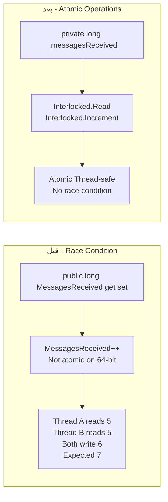
```mermaid
flowchart LR
    subgraph BEFORE["قبل - Race Condition"]
        B1[public long MessagesReceived get set]
        B2[MessagesReceived++\nNot atomic on 64-bit]
        B3[Thread A reads 5\nThread B reads 5\nBoth write 6\nExpected 7]
        B1 --> B2 --> B3
    end

    subgraph AFTER["بعد - Atomic Operations"]
        A1[private long _messagesReceived]
        A2[Interlocked.Read\nInterlocked.Increment]
        A3[Atomic Thread-safe\nNo race condition]
        A1 --> A2 --> A3
    end
```

### Fix 5 — Orleans DB Writes

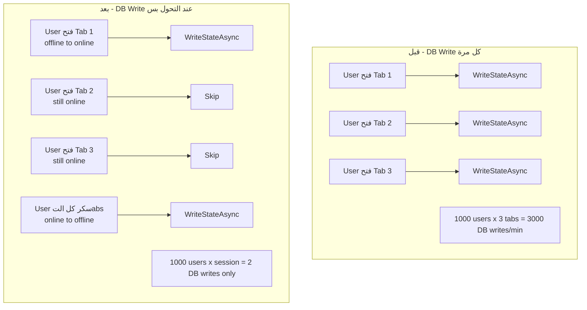
```mermaid
flowchart TD
    subgraph BEFORE["قبل - DB Write كل مرة"]
        B1[User فتح Tab 1] --> DB1[WriteStateAsync]
        B2[User فتح Tab 2] --> DB2[WriteStateAsync]
        B3[User فتح Tab 3] --> DB3[WriteStateAsync]
        N1[1000 users x 3 tabs = 3000 DB writes/min]
    end

    subgraph AFTER["بعد - DB Write عند التحول بس"]
        A1[User فتح Tab 1\noffline to online] --> ADB1[WriteStateAsync]
        A2[User فتح Tab 2\nstill online] --> ASKIP2[Skip]
        A3[User فتح Tab 3\nstill online] --> ASKIP3[Skip]
        A4[User سكر كل التabs\nonline to offline] --> ADB4[WriteStateAsync]
        N2[1000 users x session = 2 DB writes only]
    end
```

---

## 10. Clean Architecture Layers

```mermaid
graph TB
    subgraph APP["Application Layer - Core Business"]
        ABS[Abstractions\nIPipeline IMethodHandler\nIConnectionServices IUserGrain\nIRoomGrain IOutgoingMessageService\nIRateLimiter IMetricsCollector]

        HND[Handlers\nMessage 4\nCall 8\nState 2\nSync 1\nSnapshots 1]

        MSG[Messaging\nMessageContext\nMessageFrame\nFrameReader\nFrameWriter\nMessageSerializer]
    end

    subgraph INF["Infrastructure Layer - Implementations"]
        PIP[Pipeline\nMessagePipeline\nMetricsMiddleware\nRateLimitMiddleware\nDecompressionMiddleware\nDispatchMiddleware]

        GRN[Grains\nUserGrain\nRoomGrain]

        SVC[Services\nBroadcastManager\nFanOutResolverManager\nOutgoingMessageService\nConnectionServices\nLocalWebSocketRegistry\nRabbitMqPublisher\nTokenBucketRateLimiter]

        WS[WebSocketHandler\nGatewayIngressHandler\nMethodDispatcher\nConsumers 6]
    end

    subgraph GTW["Gateway Layer - Entry Point"]
        PRG[Program.cs\nAddInfraDep\nUseOrleans\nAddMassRabbitMqDep]
        MWR[WebSocketMiddleware\nJWT Validate\nAcceptWebSocket]
    end

    GTW -->|depends on| INF
    INF -->|depends on| APP
```

### Dependency Flow

```mermaid
flowchart LR
    Client --> WebSocketMiddleware
    WebSocketMiddleware --> GatewayIngressHandler
    GatewayIngressHandler --> MessagePipeline
    MessagePipeline --> MetricsMiddleware
    MetricsMiddleware --> RateLimitMiddleware
    RateLimitMiddleware --> DecompressionMiddleware
    DecompressionMiddleware --> DispatchMiddleware
    DispatchMiddleware --> MethodDispatcher
    MethodDispatcher --> Handler
    Handler --> RabbitMQ
    Handler --> Orleans
    RabbitMQ --> EgressConsumer
    EgressConsumer --> OutgoingMessageService
    OutgoingMessageService --> BroadcastManager
    BroadcastManager --> Client
```

---

## 11. Tech Stack

```mermaid
mindmap
  root((Chat Gateway))
    Runtime
      .NET 9
      ASP.NET Core
      WebSocket Binary
    Serialization
      MessagePack
      Custom Frame Protocol
      5-byte header
    Distributed State
      Microsoft Orleans
      Virtual Actor Model
      UserGrain
      RoomGrain
      MongoDB Provider
    Messaging
      MassTransit
      RabbitMQ
      6 Queues
      Ingress Publish
      Egress Consume
    Database
      MongoDB
      Orleans Grain Store
    Auth
      JWT Bearer
      Claims Principal
    Performance
      System.IO.Pipelines
      ArrayPool
      ReadOnlyMemory
      Parallel.ForEachAsync
      Zero-Copy Broadcast
    Observability
      OpenTelemetry
      ActivitySource
      IMetricsCollector
      Structured Logging
```

---

*Last updated: March 2026*
