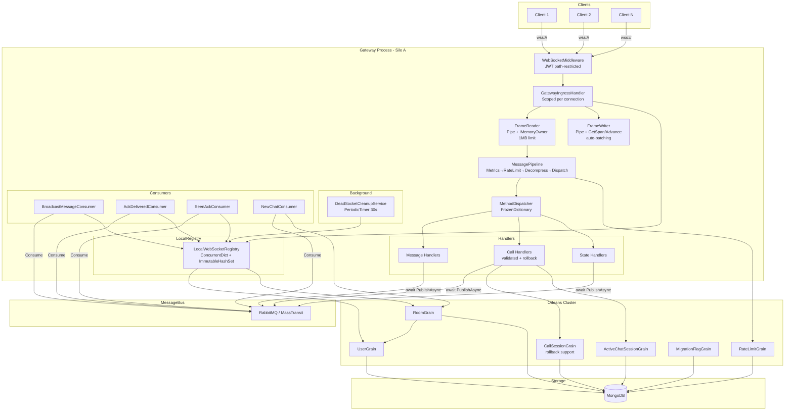
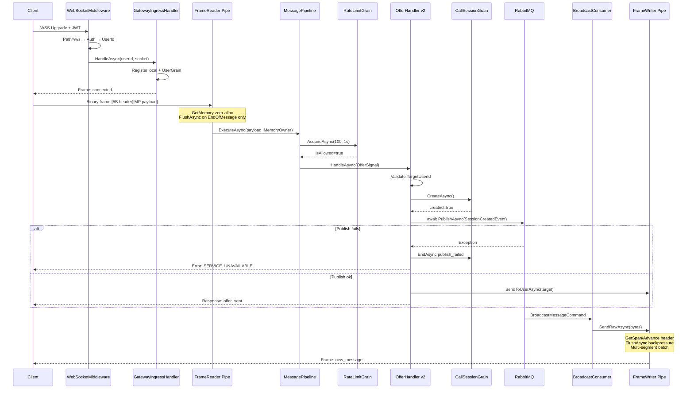
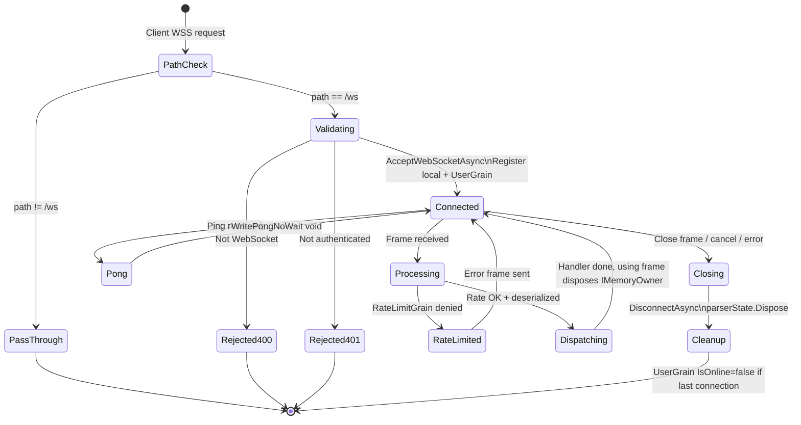

# 🌐 Gateway — Real-Time WebSocket Gateway with Microsoft Orleans

> **Production-grade technical documentation** — updated after v2 source analysis.  
> Intended for: Senior Engineers · Tech Leads · Reviewers · Production Handover

---

## Table of Contents

1. [🧠 System Summary](#-system-summary)
2. [🚀 Features Breakdown](#-features-breakdown)
3. [🏗 Architecture Analysis](#-architecture-analysis)
4. [⚡ Performance Review](#-performance-review)
5. [🔐 Security Review](#-security-review)
6. [📖 Data Flow Explanation](#-data-flow-explanation)
7. [🧩 Orleans Deep Dive](#-orleans-deep-dive)
8. [📊 System Diagrams](#-system-diagrams)
9. [✅ Resolved Issues (v2)](#-resolved-issues-v2)
10. [⚠️ Remaining Known Issues](#️-remaining-known-issues)
11. [🚀 Recommendations & Improvements](#-recommendations--improvements)
12. [📈 Final Evaluation](#-final-evaluation)

---

## 🧠 System Summary

### What the System Does

This project is a **real-time bidirectional WebSocket Gateway** built on **.NET 8** and **Microsoft Orleans 8.2** (Virtual Actor Model). It serves as the single point of entry for persistent client connections in a chat/call platform — receiving inbound messages from connected clients, dispatching them to business services via RabbitMQ, and pushing outbound events back to clients as they arrive from backend services.

### Key Responsibilities

| Responsibility | Mechanism |
|---|---|
| Accept & authenticate WebSocket connections | JWT Bearer middleware + `WebSocketMiddleware` (path-scoped) |
| Binary frame framing (read/write) | Custom binary protocol — `FrameReader`/`FrameWriter` both fully `System.IO.Pipelines` |
| Per-connection message pipeline | Chain-of-responsibility: Metrics → RateLimit → Decompress → Dispatch |
| Route inbound messages to handlers | `MethodDispatcher` via `FrozenDictionary<string, IMethodHandler>` |
| Publish domain events to backend | MassTransit → RabbitMQ |
| Receive domain events from backend | MassTransit consumers → push to socket |
| Track online/offline presence | Orleans `UserGrain` (persistent state) |
| Manage group membership | Orleans `RoomGrain` (persistent state + 30 s presence cache) |
| Enforce per-user rate limits | Orleans `RateLimitGrain` (token bucket, distributed) |
| Manage WebRTC call sessions | Orleans `CallSessionGrain` (ring timer, idempotent lifecycle, rollback support) |
| Chat-to-active-call index | Orleans `ActiveChatSessionGrain` (self-healing liveness check) |
| Startup data migration | Orleans `MigrationFlagGrain` + `RoomGrainMigrationService` |
| Dead-socket cleanup | `DeadSocketCleanupService` — single `BackgroundService` source |

### High-Level Architecture (v2)

```
Clients
  │  (wss://)
  ▼
WebSocketMiddleware  ←  JWT Auth (path-restricted to /ws, ValidateIssuer, ClockSkew=30s)
  │
GatewayIngressHandler   (Scoped per connection)
  │
  ├─ FrameReader  (System.IO.Pipelines — zero-copy pump, IMemoryOwner payload, 1MB limit)
  └─ FrameWriter  (System.IO.Pipelines — Pipe-based, GetSpan/Advance header, auto-batching)
       │
       MessagePipeline  (Singleton middleware chain)
         1. MetricsMiddleware       (OpenTelemetry — SetTag direct, zero array alloc)
         2. RateLimitMiddleware     (→ RateLimitGrain, Orleans distributed token bucket)
         3. DecompressionMiddleware (GZip magic-byte detection)
         4. DispatchMiddleware      (MessagePack deserialize → MethodDispatcher)
              │
              MethodDispatcher  (FrozenDictionary lookup, case-normalized at startup)
                │
                IMethodHandler implementations  (all Singleton)
                  ├─ Message handlers (NewMessage, Ack, Seen, Sync)
                  ├─ Call handlers    (Offer validated+rollback, Answer, ICE, Join/Leave…)
                  └─ State handlers   (UserState, GroupState)
                       │
                       IMessagePublisher → RabbitMQ (MassTransit)

RabbitMQ (Egress direction)
  │  MassTransit Consumers
  ├─ BroadcastMessageConsumer  → OutgoingMessageService → room fanout
  ├─ AckDeliveredConsumer      → OutgoingMessageService → user push
  ├─ SeenAckMessageConsumer    → OutgoingMessageService → room fanout
  ├─ AckStoreConsumer          → store acknowledgement
  ├─ NewChatConsumer           → register room + notify group
  └─ StoryBroadcastConsumer    → story fanout

Orleans Cluster (Virtual Actors)
  ├─ UserGrain           (presence, connection tracking, persistent)
  ├─ RoomGrain           (group membership, 30s presence cache, persistent)
  ├─ RateLimitGrain      (token-bucket, distributed, in-memory only)
  ├─ CallSessionGrain    (WebRTC session, ring timer, persistent + rollback support)
  ├─ ActiveChatSessionGrain (chat→session index, self-healing liveness)
  └─ MigrationFlagGrain  (startup idempotency)

Infrastructure / Background
  └─ DeadSocketCleanupService  (single BackgroundService, PeriodicTimer 30s)

Storage
  ├─ MongoDB (domain data + Orleans grain persistence)
  └─ RabbitMQ (message bus)
```

### System Type

**Stateful Real-Time Gateway** built on the **Virtual Actor Model** (Microsoft Orleans). Each user, room, and call session is represented as an in-memory grain with durable state, enabling low-latency operations without explicit distributed locks.

---

## 🚀 Features Breakdown

### Connection Management

| Feature | Status | Implementation |
|---|---|---|
| WebSocket accept with JWT gate | ✅ | `WebSocketMiddleware` rejects before `AcceptWebSocketAsync` |
| Per-connection scoped handler | ✅ | `GatewayIngressHandler` (Scoped DI) |
| Multiple connections per user | ✅ | `LocalWebSocketRegistry` user index (`ImmutableHashSet`) |
| Connection lifecycle (connect/disconnect) | ✅ | `ConnectionServices` → `UserGrain` |
| Connection ID generation | ✅ | `MessageContext.ConnectionId` = `Guid.NewGuid()` |
| Graceful close on frame type `Close` | ✅ | `GatewayIngressHandler.HandleFrameAsync` + `CloseAsync` idempotent |
| Dead-socket periodic purge | ✅ | `DeadSocketCleanupService` (single source, 30s PeriodicTimer) — **v2 fix** |
| `MessageContext` encapsulation | ✅ | `LastActivityAt` private set, `IncrementMessagesSent` private — **v2 fix** |
| `TimeProvider` injectable | ✅ | `NeedsHeartbeat()` and `ConnectedAt` via `TimeProvider.System` — **v2 fix** |
| Connection timeout / idle disconnect | ❌ | `NeedsHeartbeat()` exists but is never called |
| Client reconnection / session resume | ❌ | Not implemented |
| Heartbeat/keepalive scheduler | ❌ | `SendPing()` void exists, but no periodic sender |

### Messaging System

| Feature | Status | Implementation |
|---|---|---|
| Binary protocol (MessagePack) | ✅ | `MessageSerializer`, `MessageEnvelope` |
| Custom binary framing (5-byte header) | ✅ | `MessageFrame` (`IDisposable` + `IMemoryOwner`) — **v2 fix** |
| Frame types: Message, Response, Ping, Pong, Close, Error | ✅ | `FrameType` enum |
| Pipe-based write queue with built-in backpressure | ✅ | `FrameWriter` — `System.IO.Pipelines`, `PauseThreshold` 64 KB — **v2 fix** |
| Automatic frame batching | ✅ | `FrameWriter.SendBufferAsync` multi-segment send — **v2 new** |
| Zero-copy frame header write | ✅ | `GetSpan/Advance` directly into Pipe memory — **v2 new** |
| Max frame size enforcement | ✅ | `FrameReader` — 1 MB hard limit — **v2 fix** |
| Zero-copy frame reading | ✅ | `FrameReader` — `IMemoryOwner<byte>`, single copy — **v2 fix** |
| GZip decompression (magic-byte detection) | ✅ | `GzipMessageCompressor.IsCompressed` |
| Method-based dispatch | ✅ | `MethodDispatcher` with `FrozenDictionary` |
| Fanout to user (all connections) | ✅ | `OutgoingMessageService.SendToUserAsync` |
| Fanout to room (all members) | ✅ | `OutgoingMessageService.SendToRoomAsync` |
| Fanout with exclusion (sender excluded) | ✅ | `SendToRoomAsync(excludeUserId, ...)` |
| Fanout to a list of users | ✅ | `SendToUsersAsync` with dedup `HashSet` |
| Send API returns `ValueTask<bool>` | ✅ | Counter incremented only after success — **v2 fix** |
| `SendPing/SendPong` fire-and-forget | ✅ | `void` + `WritePingNoWait/WritePongNoWait` — **v2 fix** |
| Offline message queue | ❌ | Messages dropped if user has no active connection |
| Message persistence in gateway | ❌ | Gateway fires-and-forgets to backend; no local store |

### Authentication

| Feature | Status | Implementation |
|---|---|---|
| JWT Bearer authentication | ✅ | ASP.NET Core `AddJwtBearer` |
| Token from query string (`?token=`) | ✅ | `OnMessageReceived` event — now path-restricted — **v2 fix** |
| Query-string token restricted to `/ws` | ✅ | `StartsWithSegments("/ws")` + `IsWebSocketRequest` check — **v2 fix** |
| `ValidateIssuer` (was `ValidateActor`) | ✅ | Correct validation flag — **v2 fix** |
| `ClockSkew` reduced to 30 seconds | ✅ | Prevents token replay window — **v2 fix** |
| Missing `SecretKey` throws at startup | ✅ | `?? throw new InvalidOperationException(...)` — **v2 fix** |
| Auth failure — no details leaked to client | ✅ | `OnAuthenticationFailed` logs type only, `OnChallenge` returns generic 401 — **v2 fix** |
| Auth validation before WebSocket upgrade | ✅ | `context.User.Identity.IsAuthenticated` checked first |
| Token revocation / blacklist | ❌ | Not implemented |
| `Origin` header validation (CSWSH) | ❌ | Not implemented |
| Refresh token / re-authentication on socket | ❌ | Not implemented |

### Session Handling (WebRTC Calls)

| Feature | Status | Implementation |
|---|---|---|
| Direct call offer/answer/ICE | ✅ | `OfferMethodHandler`, `AnswerMethodHandler`, `IceCandidateMethodHandler` |
| `OfferMethodHandler` input validation | ✅ | `TargetUserId` required, self-call prevented — **v2 fix** |
| `OfferMethodHandler` awaited publish | ✅ | `await` instead of `_ =`, no fire-and-forget — **v2 fix** |
| Rollback on publish failure | ✅ | `RollbackSessionAsync` → `grain.EndAsync("publish_failed")` — **v2 new** |
| Caller confirmation `offer_sent` | ✅ | Response frame sent after successful offer — **v2 new** |
| Group call creation and join | ✅ | `CreateGroupCallHandler`, `JoinCallMethodHandler` |
| Leave call | ✅ | `LeaveCallHandler` |
| Media state (mute/unmute) | ✅ | `MediaStateHandler` |
| 30-second ring timeout | ✅ | `CallSessionGrain` → `RegisterGrainTimer` |
| Distributed atomic session create | ✅ | Grain single-threaded guarantee |
| Session persistence across restarts | ✅ | `IPersistentState<CallSessionState>` → MongoDB |
| Self-healing chat→session index | ✅ | `ActiveChatSessionGrain.GetSessionAsync()` liveness check |

### Scaling / Distribution

| Feature | Status | Implementation |
|---|---|---|
| Orleans Virtual Actor clustering | ✅ | Orleans 8.2.0 with MongoDB grain storage |
| Distributed rate limiting | ✅ | `RateLimitGrain` — one grain = one bucket across all silos |
| Distributed presence | ✅ | `UserGrain` per user, `RoomGrain` per group |
| Local socket registry (per-silo) | ✅ | `LocalWebSocketRegistry` (ConcurrentDictionary + ImmutableHashSet) |
| Cross-silo WebSocket fanout | ❌ | `LocalWebSocketRegistry` is silo-local; users on other silos are missed |
| Multi-node Orleans clustering | ❌ | `UseLocalhostClustering()` — single-silo only |
| Orleans Streams (cross-silo events) | ❌ | Acknowledged in `CallSessionGrain` as "Phase 5" future work |
| Health check endpoints | ❌ | Not configured |
| Horizontal scale readiness | ⚠️ | Architecture supports it, localhost clustering blocks it |

---

## 🏗 Architecture Analysis

### Architecture Style

**Clean Architecture** layered as:

```
Domain  ←  Application  ←  Infrastructure  ←  Gateway (Host)
```

- **Domain** (`Domain.csproj`): Pure POCO models (`Message`, `Chat`, `CallSession`, etc.). Zero framework dependencies.
- **Application** (`Application.csproj`): Abstractions, DTOs, pipeline contracts, handler base class, and all messaging primitives (`FrameReader`, `FrameWriter`, `MessageContext`, `MessageFrame`).
- **Infrastructure** (`Infrastructure.csproj`): All concrete implementations — grains, middleware, services, registry, compressor, metrics, consumers, publishers, background services.
- **Gateway / AppGateway** (`AppGateway.csproj`): Host process — `Program.cs`, Orleans silo setup, `WebSocketMiddleware`, startup migration service.

### Component Analysis (v2)

#### `WebSocketMiddleware` (v2 improved)

Path check is now the **first** guard — non-`/ws` paths pass through immediately to `_next` without any other work. Auth check and `UserId` extraction happen before `AcceptWebSocketAsync`.

#### `FrameReader` (v2 — fully rewritten)

**v1:** `ArrayPool.Rent` as intermediate buffer, then `.ToArray()` per frame = 3 copies.

**v2:** Pure `System.IO.Pipelines`. Socket pump calls `writer.GetMemory(4096)` — receives directly into Pipe memory. `TryReadFrame` uses a `SequenceReader<byte>` on the stack. Payload accumulated into `IMemoryOwner<byte>` rented once from `MemoryPool<byte>.Shared`. `MessageFrame` is `IDisposable` — handler returns memory to pool via `using(frame)`. **Total: 1 copy per frame.** Max frame size (1 MB) prevents memory exhaustion. Single `CancellationTokenSource`. `FrameParserState` is a plain `struct` (C# 12 compatible). Flush only on `EndOfMessage`.

#### `FrameWriter` (v2 — fully rewritten)

**v1:** `Channel<byte[]>` bounded to 256, `DropWrite` — silent frame loss.

**v2:** `System.IO.Pipelines` Pipe with `PauseWriterThreshold=64KB` / `ResumeWriterThreshold=32KB` (same values as Kestrel). `WriteFrameHeader` calls `_pipe.Writer.GetSpan(5)` + `Advance(5)` — header written directly into Pipe memory, zero allocation. `WritePingNoWait/WritePongNoWait` write without `FlushAsync` — coalesced into next batch automatically. `DrainAsync` reads `ReadOnlySequence<byte>` and sends segments with correct `endOfMessage` flag, achieving automatic batching. This is the same pattern used by `Microsoft.AspNetCore.SignalR` internally.

#### `MessageContext` (v2 — significantly hardened)

`sealed` class. `TimeProvider` injected for testable time. `LastActivityAt` is `private set`. `IncrementMessagesSent` is `private` — called only from `SendCoreAsync` after confirmed success. `Items` is lazy `Dictionary<string,object>` (not always-allocated `ConcurrentDictionary` — per-connection single-threaded access). `CloseAsync` is idempotent. `ConnectionDuration` computed property added. All send methods return `ValueTask<bool>`.

#### Metrics — `OpenTelemetryMetricsCollector` (v2 — hot path fixed)

**v1:** `_meter.CreateCounter(name)` on every metric call — new registration per call.

**v2:** `FrozenDictionary<string, UpDownCounter<long>>` for all known metrics pre-created at constructor. `ConcurrentDictionary` fallback for dynamic metrics. Typed overloads (0, 1, 2 tag parameters) with `TagList` (stack-allocated struct) — **zero heap allocation per metric call**. `NoOpDisposable.Instance` static singleton for `BeginScope`. `Volatile.Read/Write` for gauge entries.

#### `LocalWebSocketRegistry` (v2 — purge fixed)

`PurgeDeadConnections` previously used `Parallel.ForEach` with `lock(List)` inside — self-defeating. v2: simple `foreach` over `ConcurrentDictionary` (snapshot-safe by contract) then sequential `Unregister`. Internal `Timer` removed — `DeadSocketCleanupService` is the single source. Null guards via `ArgumentNullException.ThrowIfNull`. `RegistryStats` record struct added for health checks.

#### `OfferMethodHandler` (v2 — correctness fixed)

**v1:** `_ = _publisher.PublishAsync(...)` — fire-and-forget with unobserved exceptions. Session created but backend unaware if publish failed.

**v2:** Full `await` on publish. Input validation before any grain calls. `RollbackSessionAsync` → `grain.EndAsync("publish_failed")` if publish throws. `SendResponseAsync("offer_sent")` confirmation to caller. Target-offline handled as warning — ring timer handles expiry naturally.

### Removed Dead Code (v2)

- `WebSocketConnectionManager` — removed (was never used)
- `HandlerRegistration` — removed (`Activator.CreateInstance`-based, bypassed DI)
- `ConnectionServicesExtensions` — removed (consolidated into `InfrastructureDep`)
- Duplicate internal `Timer` in `LocalWebSocketRegistry` — removed

### Remaining Anti-Patterns

| Anti-Pattern | Location | Severity |
|---|---|---|
| `UseLocalhostClustering()` | `Program.cs` | 🔴 Critical |
| Hardcoded credentials | `appsettings.json` | 🔴 Critical |
| Cross-silo fanout broken | `FanOutResolverManager.cs` | 🔴 Critical |
| New `IServiceScope` per publish | `RabbitMqPublisher.cs` | 🟡 Medium |
| `events.Count()` on `IEnumerable` | `RabbitMqPublisher.PublishBatchAsync` | 🟡 Medium |
| `QueueService<T>` unbounded channel | `QueueService.cs` | 🟡 Medium |
| No heartbeat scheduler | `GatewayIngressHandler.cs` | 🟡 Medium |
| `GetEamil()` typo | `AuthServices.cs` | 🟢 Low |

---

## ⚡ Performance Review

### v2 Improvements Applied

**`FrameWriter` — Pipe replaces Channel:**

```
v1: Channel<byte[]>
  new byte[] per frame → Channel.TryWrite → drain → socket.SendAsync(1 frame)
  Allocations: 1 new byte[] per frame
  Socket calls: 1 per frame

v2: System.IO.Pipelines
  GetSpan/Advance (header) → Write (payload) → FlushAsync → drain → SendAsync(N frames)
  Allocations: 0 (MemoryPool, reused Pipe segments)
  Socket calls: 1 per buffer read (N frames coalesced automatically)
```

**`FrameReader` — Pure Pipe + IMemoryOwner:**

```
v1: 3 copies per frame
  ReceiveAsync(new byte[]) → copy to Pipe → copy to rented buffer → .ToArray() → new byte[]

v2: 1 copy per frame
  ReceiveAsync(pipe.GetMemory()) → copy to IMemoryOwner → MessageFrame(owner.Memory)
  Frame returned to pool via IDisposable after handler completes
```

**`OpenTelemetryMetricsCollector` — Zero hot-path allocation:**

```
v1: CreateCounter() on every call → new Counter registration per call
v2: FrozenDictionary lookup (O(1)) + TagList (stack) → zero heap allocation
```

### Remaining Bottlenecks

`RabbitMqPublisher` creates a new `IServiceScope` on every message publish — GC pressure under high throughput. Should inject `IBus` directly (MassTransit registers it as Singleton).

`UserGrain._activeConnections` is transient (lost on silo restart). `IsOnline` in MongoDB can remain stale-true after a crash before a reconnect clears it.

Cross-silo fanout: `FanOutResolverManager` retrieves group members from `RoomGrain` (correct, distributed) but looks up sockets in `LocalWebSocketRegistry` (silo-local). Users on other silos are silently missed — correctness issue, not just performance.

---

## 🔐 Security Review

### Fixed in v2

**JWT query-string token path restriction:**

```csharp
OnMessageReceived = context =>
{
    if (!context.HttpContext.Request.Path.StartsWithSegments("/ws"))
        return Task.CompletedTask;
    if (!context.HttpContext.WebSockets.IsWebSocketRequest)
        return Task.CompletedTask;
    var token = context.Request.Query["token"].FirstOrDefault();
    if (!string.IsNullOrWhiteSpace(token)) context.Token = token;
    return Task.CompletedTask;
};
```

**Auth error details no longer leaked:**

- `OnAuthenticationFailed` logs exception type only (not message)
- `OnChallenge` returns generic `{"error":"unauthorized","message":"Authentication required"}`

**Missing `SecretKey` throws at startup** — no silent null signing key.

**`ValidateIssuer` corrected** — was `ValidateActor` in v1.

**`ClockSkew` reduced** from default 5 minutes to 30 seconds.

**Frame size validation added** — 1 MB hard limit in `FrameReader`. Connection closed on violation.

### Remaining Vulnerabilities

#### 🔴 Critical — Credentials in `appsettings.json`

```json
"JWT": { "SecretKey": "YourSuperSecretKeyForJwtAuthentication" },
"RabbitMqSettings": { "Username": "guest", "Password": "guest" }
```
Hardcoded in source-controlled config. Must use environment variables or secrets manager.

#### 🟡 Medium — No `Origin` Header Validation

No allowlist check on the `Origin` header in `WebSocketMiddleware`. A malicious page can open a WebSocket to the gateway if the user has a valid JWT.

#### 🟡 Medium — No Token Revocation

JWT valid until expiry regardless of logout or account suspension. Requires short expiry + refresh token cycling or a revocation list.

#### 🟢 Low — `GetEamil()` Typo

`AuthServices.GetEamil()` — minor naming error.

---

## 📖 Data Flow Explanation

### Step 1 — Client Connection

```
Client → GET /ws HTTP/1.1
         Upgrade: websocket
         Authorization: Bearer <jwt>   OR   ?token=<jwt>  (WebSocket path only — v2 fix)
```

1. `UseAuthentication()` validates JWT, populates `context.User`.
2. `WebSocketMiddleware` checks path `/ws` **first** — non-WS paths pass to `_next`.
3. Rejects non-WebSocket → `400`.
4. Rejects unauthenticated → `401`.
5. Rejects missing `UserId` claim → `401`.
6. `AcceptWebSocketAsync()` upgrades.
7. New DI scope created; `IGatewayIngressHandler` resolved (Scoped).
8. `GatewayIngressHandler.HandleAsync(userId, socket, ct)` begins.

### Step 2 — Connection Registration

```
GatewayIngressHandler
  → FrameReader / FrameWriter constructed (both Pipe-based, v2)
  → MessageContext created (ConnectionId = Guid, TimeProvider.System)
  → ConnectionServices.ConnectAsync(userId, context)
      → LocalWebSocketRegistry.Register(userId, context)    [local O(1)]
      → UserGrain.ConnectAsync(connectionId)               [Orleans, persisted]
  → FrameWriter.Start() — Pipe drain loop starts
  → FrameReader.Start() — socket pump starts
  → "connected" response frame sent to client
```

### Step 3 — Inbound Message Processing

```
Client sends binary frame: [4-byte length BE][1-byte type][MessagePack payload]

FrameReader pump:
  socket.ReceiveAsync(pipe.GetMemory(4096))  ← zero alloc (Pipe memory)
  pipe.Writer.Advance(count)
  pipe.Writer.FlushAsync() on EndOfMessage only

ReadFramesAsync:
  pipe.Reader.ReadAsync()
  TryReadFrame (SequenceReader stack, IMemoryOwner for payload)
  yields MessageFrame (IDisposable)

GatewayIngressHandler.HandleFrameAsync:
  using (frame) {   ← returns IMemoryOwner to pool after handler completes
    switch FrameType:
      Message → pipeline.ExecuteAsync(context, frame.Payload, ct)
      Ping    → context.SendPong()  [void, WritePongNoWait]
      Close   → context.CloseAsync()
  }

MessagePipeline:
  1. MetricsMiddleware: StartActivity (SetTag direct, no array alloc), Stopwatch
  2. RateLimitMiddleware: RateLimitGrain.AcquireAsync(100, 1s)
  3. DecompressionMiddleware: IsCompressed(magic bytes) → GZip if needed
  4. DispatchMiddleware: MessagePack deserialize → validate → DispatchAsync
```

### Step 4 — Handler Execution (Offer example, v2)

```
MethodDispatcher: FrozenDictionary.TryGetValue(method.ToLowerInvariant())
  → OfferMethodHandler.HandleAsync:
      Step 1: validate TargetUserId, self-call guard
      Step 2: CallSessionGrain.CreateAsync()           ← atomic grain
      Step 3: await _publisher.PublishAsync(event)     ← awaited, not fire-and-forget
               on failure: RollbackSessionAsync → grain.EndAsync("publish_failed")
      Step 4: await outgoingMessage.SendToUserAsync()  ← target notification
      Step 5: context.SendResponseAsync("offer_sent")  ← caller confirmation
```

### Step 5 — Outbound Event Processing

```
Backend → BroadcastMessageCommand → RabbitMQ
Gateway BroadcastMessageConsumer.Consume(...)
  → OutgoingMessageService.SendToRoomAsync(excludeUserId, chatId, message)
      → FanOutResolverManager.ResolveGroupContextsAsync(chatId)
          → RoomGrain.GetMembersAsync()              [Orleans distributed]
          → LocalWebSocketRegistry.GetUserContexts() [silo-local lookup]
      → for each context: MessageContext.SendRawAsync(serializedBytes)
          → FrameWriter.WriteRawAsync()
              → WriteFrameHeader: GetSpan/Advance (zero alloc)
              → pipe.Writer.Write(payload)
              → pipe.Writer.FlushAsync()  ← built-in backpressure if > 64KB
              → DrainAsync: coalesced multi-segment send to socket
```

### Step 6 — Disconnection

```
FrameReader.ReadFramesAsync completes
  → parserState.Dispose() — returns pending IMemoryOwner to pool

GatewayIngressHandler finally:
  → ConnectionServices.DisconnectAsync(userId, connectionId)
      → LocalWebSocketRegistry.Unregister(connectionId)
      → UserGrain.DisconnectAsync(connectionId)
           → removes from _activeConnections
           → if empty: IsOnline=false, WriteStateAsync → MongoDB
```

---

## 🧩 Orleans Deep Dive

### Correctly Used Grains

#### ✅ `UserGrain` — Presence Tracking
Single-threaded grain keyed by `userId`. Persists `IsOnline`/`LastSeen`. In-memory `HashSet<string>` for active connections. Writes state only on first connect and last disconnect.

#### ✅ `RateLimitGrain` — Distributed Token Bucket
Per-user grain. Single-threaded execution replaces `Interlocked` CAS. `RegisterGrainTimer` for refill. In-memory only. One bucket per user across **all silos** — accurate in multi-node clusters.

#### ✅ `CallSessionGrain` — WebRTC Session (v2 improved)
`CreateAsync` atomic by grain contract. One-shot `IGrainTimer` (ring). Persisted state. `DeactivateOnIdle()` on `EndAsync`. v2 improvement: caller now `awaits` `PublishAsync` and calls `grain.EndAsync("publish_failed")` on failure — grain state stays consistent with backend.

#### ✅ `ActiveChatSessionGrain` — Self-Healing Index
`GetSessionAsync()` validates liveness via `ICallSessionGrain.IsActiveAsync()`. Stale entries auto-cleared on next read.

#### ✅ `MigrationFlagGrain` — Idempotent Startup
`RoomGrainMigrationService` uses `IMigrationFlagGrain` to run MongoDB → RoomGrain migration exactly once.

### Where Orleans Is Still NOT Used But Should Be

#### ❌ Cross-Silo WebSocket Fanout (Critical — unchanged)

`LocalWebSocketRegistry` is per-silo. `BroadcastMessageConsumer` on Silo A cannot reach users on Silo B.

**Required:** Orleans Streams per-user/per-room.

```csharp
// Publish side (any grain/consumer):
var stream = streamProvider.GetStream<OutgoingMessage>(StreamId.Create("rooms", roomId));
await stream.OnNextAsync(message);

// Subscribe side (each silo, per connected user):
await stream.SubscribeAsync(async (msg, _) => {
    foreach (var ctx in _localRegistry.GetUserContexts(userId))
        await ctx.SendRawAsync(serializedMsg, FrameType.Message);
});
```

#### ❌ Heartbeat / Idle Connection Management via Reminders

`MessageContext.NeedsHeartbeat(timeout)` is now testable via `TimeProvider` but **never called**. Should be driven by an Orleans Reminder on `UserGrain`.

### Grain Type Recommendations

| Recommended Grain | Purpose | Priority |
|---|---|---|
| `INotificationStreamGrain` | Per-room/per-user Orleans Stream subscriber | 🔴 High |
| `IHeartbeatGrain` | Reminder-based ping scheduler | 🟡 Medium |
| `IOfflineInboxGrain` | Queue messages for offline users | 🟡 Medium |

---

## 📊 System Diagrams

### 🔹 Architecture Diagram



### 🔹 Sequence Diagram — Offer Flow (v2)



### 🔹 Connection Lifecycle (v2)



---

## ✅ Resolved Issues (v2)

The following issues identified in the v1 analysis have been **fully resolved**:

| # | Issue | Resolution |
|---|---|---|
| 1 | `OpenTelemetryMetricsCollector` creates instruments on every call | ✅ `FrozenDictionary` pre-warmed + `ConcurrentDictionary` fallback + `TagList` stack |
| 2 | `MetricsMiddleware` `new[]` tag arrays on every message | ✅ Direct `SetTag` calls + typed 2-tag overloads. Zero heap alloc. |
| 3 | `FrameWriter` `Channel<byte[]>` with silent `DropWrite` | ✅ `System.IO.Pipelines`. Built-in backpressure. Auto-batching. Zero alloc header. |
| 4 | `FrameReader` 3 copies per frame (`ToArray()` hot path) | ✅ Pure Pipelines. `IMemoryOwner<byte>`. 1 copy. `FrameParserState` struct. |
| 5 | No frame size validation — memory exhaustion vector | ✅ 1 MB hard limit. Connection closed on violation. |
| 6 | `MessageFrame` not returning buffer to pool | ✅ `MessageFrame : IDisposable`, `using(frame)` in handler. |
| 7 | `MessageContext` — `LastActivityAt` public set, counter before send | ✅ `private set`, counter only after success. |
| 8 | `MessageContext` — `DateTime.UtcNow` hardcoded | ✅ `TimeProvider` injected, testable. |
| 9 | `MessageContext.Items` always-allocated `ConcurrentDictionary` | ✅ Lazy `Dictionary<string,object>`. |
| 10 | `SendAsync/SendRaw/SendResponse/SendError` return `Task` | ✅ All return `ValueTask<bool>`. |
| 11 | `SendPing/SendPong` return `Task` + allocate | ✅ `void` + `WritePingNoWait/WritePongNoWait`. |
| 12 | `CloseAsync` not idempotent | ✅ Guard clause on `Closing \| Disconnected`. |
| 13 | JWT query-string token accepted on all paths | ✅ Restricted to `/ws` + `IsWebSocketRequest`. |
| 14 | `ValidateActor` (wrong flag) | ✅ Corrected to `ValidateIssuer`. |
| 15 | Missing JWT `SecretKey` silent null | ✅ Throws `InvalidOperationException` at startup. |
| 16 | Auth failure details exposed to client | ✅ `OnAuthenticationFailed` logs type only. Generic 401 response. |
| 17 | `ClockSkew` default 5 minutes | ✅ Reduced to 30 seconds. |
| 18 | `OfferMethodHandler` fire-and-forget `_ = PublishAsync()` | ✅ Full `await`. Grain rollback on failure. |
| 19 | `OfferMethodHandler` no input validation | ✅ `TargetUserId` null check + self-call guard. |
| 20 | `PurgeDeadConnections` `lock()` inside `Parallel.ForEach` | ✅ Simple lock-free `foreach`. |
| 21 | Duplicate timers for dead-socket cleanup | ✅ Internal `Timer` removed. Single `DeadSocketCleanupService`. |
| 22 | Dead code `WebSocketConnectionManager` | ✅ Removed. |
| 23 | Dead code `HandlerRegistration` (`Activator.CreateInstance`) | ✅ Removed. |
| 24 | Double `CancelAsync` in `FrameReader.DisposeAsync` | ✅ Single CTS, single cancel path. |
| 25 | `FrameReader` flushes on every receive chunk | ✅ Flush only on `EndOfMessage`. |

---

## ⚠️ Remaining Known Issues

| # | Issue | Severity | Component |
|---|---|---|---|
| 1 | `UseLocalhostClustering()` — single-silo, no fault tolerance | 🔴 Critical | `Program.cs` |
| 2 | JWT `SecretKey` weak hardcoded string | 🔴 Critical | `appsettings.json` |
| 3 | RabbitMQ credentials `guest/guest` hardcoded | 🔴 Critical | `appsettings.json` |
| 4 | Cross-silo WebSocket fanout broken — per-silo registry | 🔴 Critical | `FanOutResolverManager.cs` |
| 5 | No `Origin` header validation — CSWSH risk | 🟡 Medium | `WebSocketMiddleware.cs` |
| 6 | No heartbeat scheduler — `NeedsHeartbeat()` never called | 🟡 Medium | `GatewayIngressHandler.cs` |
| 7 | No connection idle timeout | 🟡 Medium | `GatewayIngressHandler.cs` |
| 8 | `RabbitMqPublisher` creates new `IServiceScope` per publish | 🟡 Medium | `RabbitMqPublisher.cs` |
| 9 | `QueueService<T>` uses `Channel.CreateUnbounded<T>()` | 🟡 Medium | `QueueService.cs` |
| 10 | `PublishBatchAsync` — `events.Count()` on `IEnumerable` | 🟡 Medium | `RabbitMqPublisher.cs` |
| 11 | `UserGrain.IsOnline` can be stale-true after silo crash | 🟡 Medium | `UserGrain.cs` |
| 12 | No health check endpoints (`/health`, `/ready`) | 🟢 Low | `Program.cs` |
| 13 | No OpenTelemetry export configured | 🟢 Low | `Program.cs` |
| 14 | No `docker-compose.yml` | 🟢 Low | Root |
| 15 | `GetEamil()` typo in `AuthServices` | 🟢 Low | `AuthServices.cs` |

---

## 🚀 Recommendations & Improvements

### Priority: 🔴 High (Production Blockers — still open)

**1. Replace `UseLocalhostClustering()` with Distributed Clustering**

```csharp
silo.UseMongoDBClustering(options => {
    options.ConnectionString = config["MongoSettings:ConnectionString"];
    options.DatabaseName = "OrleansCluster";
});
```

**2. Move All Secrets to Environment Variables / Key Vault**

```json
// appsettings.json — empty, values come from environment:
"JWT": { "SecretKey": "" }
// Runtime: JWT__SecretKey=<vault-secret>
```

**3. Fix Cross-Silo Fanout — Orleans Streams**

```csharp
// Subscribe per-user on connection:
var stream = streamProvider.GetStream<OutgoingMessage>(
    StreamId.Create("user-outbox", userId));
await stream.SubscribeAsync(OnOutgoingMessageAsync);

// Publish from any grain/consumer on any silo:
await stream.OnNextAsync(message);
```

**4. Fix `RabbitMqPublisher` — Remove Per-Call Scope**

```csharp
public sealed class RabbitMqPublisher : IMessagePublisher
{
    private readonly IBus _bus; // Singleton registered by MassTransit
    public RabbitMqPublisher(IBus bus) => _bus = bus;
    public Task PublishAsync<T>(T message) => _bus.Publish(message);
}
```

### Priority: 🟡 Medium (Reliability Improvements)

**5. Implement Heartbeat / Idle Timeout**

```csharp
var heartbeatTask = Task.Run(async () => {
    using var timer = new PeriodicTimer(TimeSpan.FromSeconds(30));
    while (await timer.WaitForNextTickAsync(cancellationToken))
    {
        if (context.NeedsHeartbeat(TimeSpan.FromSeconds(60)))
            context.SendPing();  // void, WritePingNoWait
        if (context.NeedsHeartbeat(TimeSpan.FromSeconds(120)))
        {
            await context.CloseAsync(); break;
        }
    }
}, cancellationToken);
```

**6. Add `Origin` Header Validation**

```csharp
_allowedOrigins = configuration
    .GetSection("WebSocket:AllowedOrigins")
    .Get<string[]>()
    ?.ToHashSet(StringComparer.OrdinalIgnoreCase) ?? new HashSet<string>();

// In InvokeAsync before AcceptWebSocketAsync:
if (!IsOriginAllowed(context.Request)) {
    context.Response.StatusCode = 403; return;
}
```

**7. Bound `QueueService<T>`**

```csharp
_channel = Channel.CreateBounded<T>(new BoundedChannelOptions(10_000) {
    FullMode = BoundedChannelFullMode.DropOldest
});
```

**8. Fix `PublishBatchAsync` Double Enumeration**

```csharp
var list = events as ICollection<object> ?? events.ToList();
await publishEndpoint.PublishBatch(list);
_logger.LogDebug("Published batch of {Count} events", list.Count);
```

### Priority: 🟢 Low (Quality / Observability)

**9. Add Health Check Endpoints**

```csharp
builder.Services.AddHealthChecks()
    .AddCheck("rabbitmq", () => /* MassTransit bus status */)
    .AddMongoDb(connectionString)
    .AddCheck("orleans", () => /* grain factory probe */);

app.MapHealthChecks("/health");
app.MapHealthChecks("/ready", new HealthCheckOptions {
    Predicate = h => h.Tags.Contains("ready")
});
```

**10. Configure OpenTelemetry Export**

```csharp
builder.Services.AddOpenTelemetry()
    .WithMetrics(m => m
        .AddMeter("ChatSystem.Gateway")
        .AddOtlpExporter(o => o.Endpoint = new Uri(config["Otel:Endpoint"])))
    .WithTracing(t => t
        .AddSource("ChatGateway.MessagePipeline")
        .AddOtlpExporter());
```

**11. Add `docker-compose.yml`**

```yaml
services:
  gateway:
    build: .
    ports: ["5000:5000"]
    environment:
      - MongoSettings__ConnectionString=mongodb://mongo:27017
      - RabbitMqSettings__Host=rabbitmq
      - JWT__SecretKey=${JWT_SECRET_KEY}
    depends_on: [mongo, rabbitmq]
  mongo:
    image: mongo:7
    ports: ["27017:27017"]
  rabbitmq:
    image: rabbitmq:3-management
    ports: ["5672:5672", "15672:15672"]
```

**12. Fix `AuthServices.GetEamil()` Typo**

```csharp
public string? GetEmail() // was: GetEamil()
```

---

## 📈 Final Evaluation

### 🔢 System Score

| Dimension | v1 Score | v2 Score | Key Changes in v2 |
|---|---|---|---|
| **Architecture** | 7.5 / 10 | **8.0 / 10** | Dead code removed. `BackgroundService` separated. `MessageContext` encapsulation. |
| **Scalability** | 5.0 / 10 | **5.5 / 10** | Frame size protection. Proper `PeriodicTimer` cleanup. Core multi-silo gap unchanged. |
| **Code Quality** | 6.5 / 10 | **8.0 / 10** | `TimeProvider`, `ValueTask<bool>`, `private set`, lazy `Dictionary`, Pipe I/O, `IMemoryOwner`, `FrameParserState`, `RegistryStats`, offer rollback — major uplift. |
| **Security** | 4.0 / 10 | **5.5 / 10** | JWT path restriction, `ValidateIssuer`, `ClockSkew`, startup null-guard, generic auth errors, 1MB frame limit. Credentials still hardcoded. |
| **Overall** | **5.75 / 10** | **6.75 / 10** | |

### 🧠 Summary Judgment

**Is it production-ready?** — **Closer, but still No.**

v2 delivers substantial and measurable improvements. The most impactful changes:

- **`FrameWriter` and `FrameReader` full `System.IO.Pipelines` rewrite** — eliminates the most significant allocation sources in the hot path. Replaces silent frame drop with built-in Pipe backpressure. Automatic batching reduces socket calls. This alone brings the I/O layer to the same standard as ASP.NET Core Kestrel and SignalR.
- **`OpenTelemetryMetricsCollector` hot-path fix** — `FrozenDictionary` pre-warmed instruments with `TagList` stack-allocated overloads. Zero allocation per metric call in the hot path.
- **`OfferMethodHandler` correctness** — fire-and-forget replaced with `await` + grain rollback. Grain/backend state now stays consistent on failure.
- **JWT security hardening** — token path restriction, correct validation flags, reduced clock skew, no details leaked to clients.
- **Dead code removal** — `WebSocketConnectionManager`, `HandlerRegistration`, `ConnectionServicesExtensions` cleanly removed.

**What remains blocking production:**

| Item | Priority |
|---|---|
| Distributed Orleans clustering (MongoDB/Azure) | 🔴 Must Have |
| Secrets management (env vars / Key Vault) | 🔴 Must Have |
| Orleans Streams for cross-silo fanout | 🔴 Must Have |
| Fix `RabbitMqPublisher` per-call scope | 🟡 Should Have |
| Heartbeat / idle timeout scheduler | 🟡 Should Have |
| `Origin` header validation | 🟡 Should Have |
| Health check endpoints | 🟡 Should Have |
| OpenTelemetry export configuration | 🟡 Should Have |
| Docker Compose for local development | 🟢 Nice to Have |

**With the 3 "Must Have" items resolved**, the codebase has the architectural depth and code quality to support a production deployment. The performance foundations — `System.IO.Pipelines`, `IMemoryOwner`, `FrozenDictionary`, `TagList` — are now genuinely competitive with production-grade frameworks like ASP.NET Core SignalR.

---

*v1 generated from initial source analysis. v2 updated after applying fixes across: `FrameWriter`, `FrameReader`, `MessageFrame`, `MessageContext`, `OpenTelemetryMetricsCollector`, `MetricsMiddleware`, `WebSocketMiddleware`, `InfrastructureDep` (JWT), `OfferMethodHandler`, `LocalWebSocketRegistry`, `DeadSocketCleanupService`.*  
*Stack: .NET 8 · Microsoft Orleans 8.2 · MassTransit 9.x · RabbitMQ · MongoDB · MessagePack · System.IO.Pipelines*
