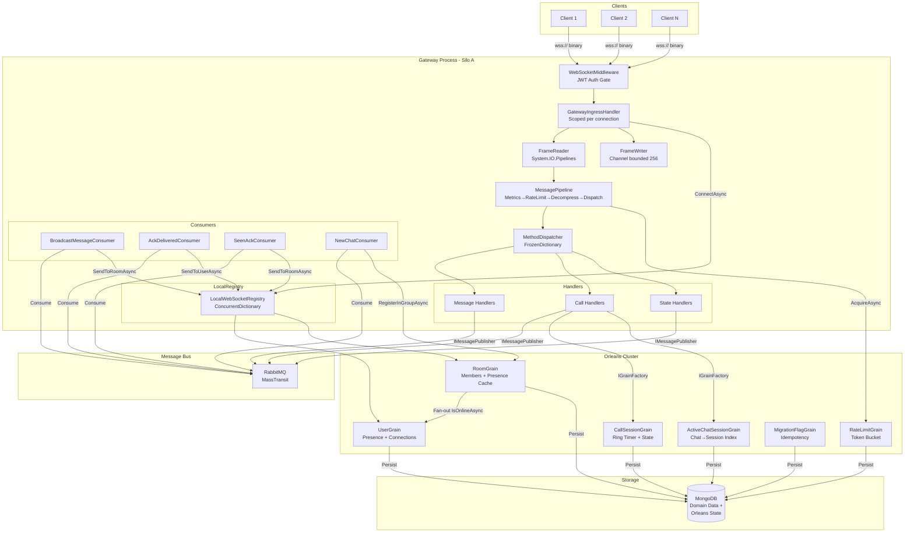
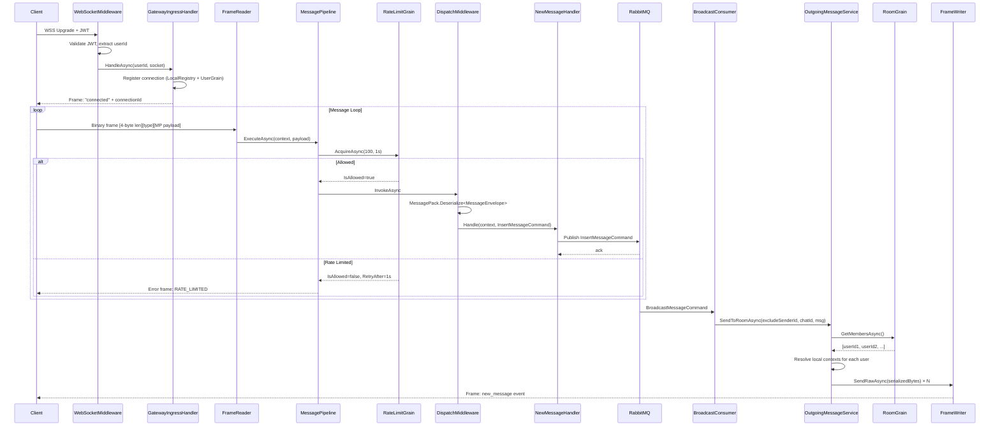
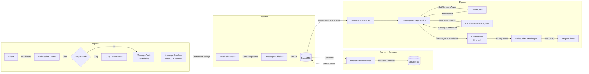
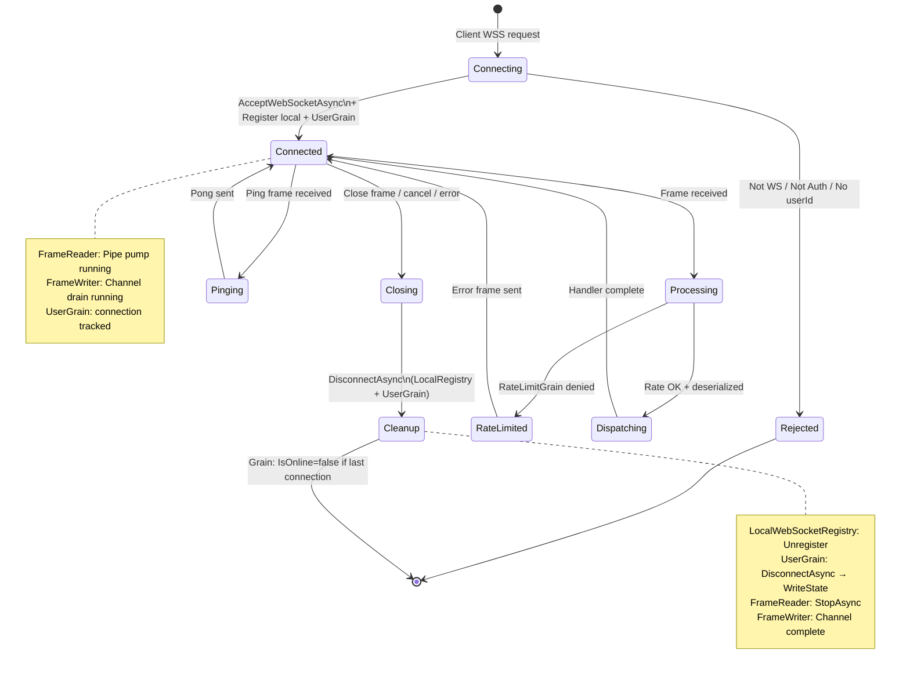
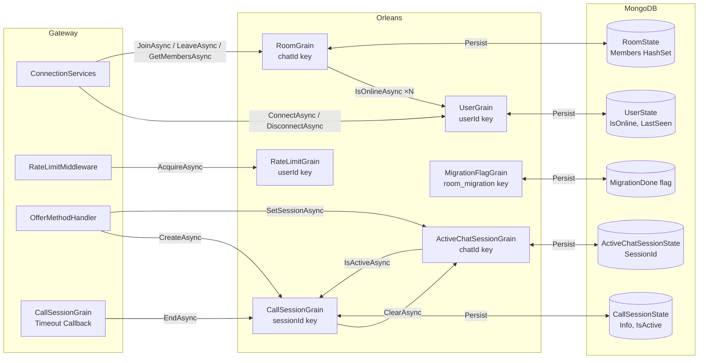

# 🌐 Gateway — Real-Time WebSocket Gateway with Microsoft Orleans

> **Production-grade technical documentation** — generated from full source analysis.  
> Intended for: Senior Engineers · Tech Leads · Reviewers · Production Handover

---

## Table of Contents

1. [🧠 System Summary](#-system-summary)
2. [🚀 Features Breakdown](#-features-breakdown)
3. [🏗 Architecture Analysis](#-architecture-analysis)
4. [⚡ Performance Review](#-performance-review)
5. [🔐 Security Review](#-security-review)
6. [📖 Data Flow Explanation](#-data-flow-explanation)
7. [🧩 Orleans Deep Dive](#-orleans-deep-dive)
8. [📊 System Diagrams](#-system-diagrams)
9. [⚠️ Known Issues](#️-known-issues)
10. [🚀 Recommendations & Improvements](#-recommendations--improvements)
11. [📈 Final Evaluation](#-final-evaluation)

---

## 🧠 System Summary

### What the System Does

This project is a **real-time bidirectional WebSocket Gateway** built on **.NET 8** and **Microsoft Orleans 8.2** (Virtual Actor Model). It serves as the single point of entry for persistent client connections in a chat/call platform — receiving inbound messages from connected clients, dispatching them to business services via RabbitMQ, and pushing outbound events back to clients as they arrive from backend services.

### Key Responsibilities

| Responsibility | Mechanism |
|---|---|
| Accept & authenticate WebSocket connections | JWT Bearer middleware + WebSocketMiddleware |
| Binary frame framing (read/write) | Custom binary protocol over `System.IO.Pipelines` |
| Per-connection message pipeline | Chain-of-responsibility: Metrics → RateLimit → Decompress → Dispatch |
| Route inbound messages to handlers | `MethodDispatcher` via `FrozenDictionary<string, IMethodHandler>` |
| Publish domain events to backend | MassTransit → RabbitMQ |
| Receive domain events from backend | MassTransit consumers → push to socket |
| Track online/offline presence | Orleans `UserGrain` (persistent state) |
| Manage group membership | Orleans `RoomGrain` (persistent state + 30 s presence cache) |
| Enforce per-user rate limits | Orleans `RateLimitGrain` (token bucket, distributed) |
| Manage WebRTC call sessions | Orleans `CallSessionGrain` (ring timer, idempotent lifecycle) |
| Chat-to-active-call index | Orleans `ActiveChatSessionGrain` (self-healing liveness check) |
| Startup data migration | Orleans `MigrationFlagGrain` + `RoomGrainMigrationService` |

### High-Level Architecture

```
Clients
  │  (wss://)
  ▼
WebSocketMiddleware  ←  JWT Auth (ASP.NET Core)
  │
GatewayIngressHandler   (Scoped per connection)
  │  System.IO.Pipelines
  ├─ FrameReader (Pipe-based, ArrayPool)
  └─ FrameWriter (Channel<byte[]>, bounded, drain loop)
       │
       MessagePipeline  (Singleton middleware chain)
         1. MetricsMiddleware       (OpenTelemetry ActivitySource)
         2. RateLimitMiddleware     (→ RateLimitGrain, Orleans)
         3. DecompressionMiddleware (GZip magic-byte detection)
         4. DispatchMiddleware      (MessagePack deserialize → MethodDispatcher)
              │
              MethodDispatcher  (FrozenDictionary lookup)
                │
                IMethodHandler implementations
                  ├─ Message handlers (NewMessage, Ack, Seen, Sync)
                  ├─ Call handlers    (Offer, Answer, IceCandidate, Join/Leave, etc.)
                  └─ State handlers   (UserState, GroupState)
                       │
                       IMessagePublisher → RabbitMQ (MassTransit)

RabbitMQ (Egress direction)
  │  MassTransit Consumers
  ├─ BroadcastMessageConsumer  → OutgoingMessageService → room fanout
  ├─ AckDeliveredConsumer      → OutgoingMessageService → user push
  ├─ SeenAckMessageConsumer    → OutgoingMessageService → room fanout
  ├─ AckStoreConsumer          → store acknowledgement
  ├─ NewChatConsumer           → register room + notify group
  └─ StoryBroadcastConsumer    → story fanout

Orleans Cluster (Virtual Actors)
  ├─ UserGrain      (presence, connection tracking)
  ├─ RoomGrain      (group membership, presence cache)
  ├─ RateLimitGrain (token-bucket rate limiter)
  ├─ CallSessionGrain (WebRTC session, ring timer)
  ├─ ActiveChatSessionGrain (chat→session index, self-healing)
  └─ MigrationFlagGrain (startup idempotency)

Storage
  ├─ MongoDB (domain data + Orleans grain persistence)
  └─ RabbitMQ (message bus)
```

### System Type

**Stateful Real-Time Gateway** built on the **Virtual Actor Model** (Microsoft Orleans). Each user, room, and call session is represented as an in-memory grain with durable state, enabling low-latency operations without explicit distributed locks.

---

## 🚀 Features Breakdown

### Connection Management

| Feature | Status | Implementation |
|---|---|---|
| WebSocket accept with JWT gate | ✅ | `WebSocketMiddleware` rejects before `AcceptWebSocketAsync` |
| Per-connection scoped handler | ✅ | `GatewayIngressHandler` (Scoped DI) |
| Multiple connections per user | ✅ | `LocalWebSocketRegistry` user index (`ImmutableHashSet`) |
| Connection lifecycle (connect/disconnect) | ✅ | `ConnectionServices` → `UserGrain` |
| Connection ID generation | ✅ | `MessageContext.ConnectionId` = `Guid.NewGuid()` |
| Graceful close on frame type `Close` | ✅ | `GatewayIngressHandler.HandleFrameAsync` |
| Dead-socket periodic purge | ✅ | `LocalWebSocketRegistry` internal timer (30 s) + `DeadSocketCleanupService` (60 s) |
| Connection timeout / idle disconnect | ❌ | `NeedsHeartbeat()` exists on `MessageContext` but is never called |
| Client reconnection / session resume | ❌ | Not implemented |
| Heartbeat/keepalive scheduler | ❌ | Ping frame handled, but no periodic sender |

### Messaging System

| Feature | Status | Implementation |
|---|---|---|
| Binary protocol (MessagePack) | ✅ | `MessageSerializer`, `MessageEnvelope` |
| Custom binary framing (5-byte header) | ✅ | `MessageFrame` (4-byte length + 1-byte type) |
| Frame types: Message, Response, Ping, Pong, Close, Error | ✅ | `FrameType` enum |
| Backpressure-safe async write queue | ✅ | `FrameWriter` — bounded `Channel<byte[]>` (256), drain loop |
| GZip decompression (magic-byte detection) | ✅ | `GzipMessageCompressor.IsCompressed` |
| Method-based dispatch | ✅ | `MethodDispatcher` with `FrozenDictionary` |
| Fanout to user (all connections) | ✅ | `OutgoingMessageService.SendToUserAsync` |
| Fanout to room (all members) | ✅ | `OutgoingMessageService.SendToRoomAsync` |
| Fanout with exclusion (sender excluded) | ✅ | `SendToRoomAsync(excludeUserId, ...)` |
| Fanout to a list of users | ✅ | `SendToUsersAsync` with dedup `HashSet` |
| Offline message queue | ❌ | Messages dropped if user has no active connection |
| Message persistence in gateway | ❌ | Gateway fires-and-forgets to backend; no local store |

### Authentication

| Feature | Status | Implementation |
|---|---|---|
| JWT Bearer authentication | ✅ | ASP.NET Core `AddJwtBearer` |
| Token from query string (`?token=`) | ✅ | `OnMessageReceived` event |
| Auth validation before WebSocket upgrade | ✅ | `context.User.Identity.IsAuthenticated` checked first |
| UserId extracted from claims | ✅ | `ClaimTypes.NameIdentifier` |
| Token revocation / blacklist | ❌ | Not implemented |
| Path restriction on query-string token | ❌ | Token accepted from query string on all paths, not just `/ws` |
| Refresh token / re-authentication on socket | ❌ | Not implemented |

### Session Handling (WebRTC Calls)

| Feature | Status | Implementation |
|---|---|---|
| Direct call offer/answer/ICE | ✅ | `OfferMethodHandler`, `AnswerMethodHandler`, `IceCandidateMethodHandler` |
| Group call creation and join | ✅ | `CreateGroupCallHandler`, `JoinCallMethodHandler` |
| Leave call | ✅ | `LeaveCallHandler` |
| Media state (mute/unmute) | ✅ | `MediaStateHandler` |
| 30-second ring timeout (no-answer end) | ✅ | `CallSessionGrain` → `RegisterGrainTimer` |
| Distributed atomic session create (no race condition) | ✅ | Grain single-threaded guarantee |
| Session persistence across restarts | ✅ | `IPersistentState<CallSessionState>` → MongoDB |
| Self-healing chat→session index | ✅ | `ActiveChatSessionGrain.GetSessionAsync()` liveness check |
| Group signal relay | ✅ | `GroupSignalMethodHandler` |

### Scaling / Distribution

| Feature | Status | Implementation |
|---|---|---|
| Orleans Virtual Actor clustering | ✅ | Orleans 8.2.0 with MongoDB grain storage |
| Distributed rate limiting | ✅ | `RateLimitGrain` — one grain = one bucket across all silos |
| Distributed presence | ✅ | `UserGrain` per user, `RoomGrain` per group |
| Local socket registry (per-silo) | ✅ | `LocalWebSocketRegistry` (ConcurrentDictionary) |
| Cross-silo WebSocket fanout | ❌ | `LocalWebSocketRegistry` is silo-local; users on other silos are missed |
| Multi-node Orleans clustering | ❌ | `UseLocalhostClustering()` — single-silo only |
| Orleans Streams (cross-silo events) | ❌ | Acknowledged in `CallSessionGrain` as "Phase 5" future work |
| Health check endpoints | ❌ | Not configured |
| Horizontal scale readiness | ⚠️ | Architecture supports it, but localhost clustering blocks it |

---

## 🏗 Architecture Analysis

### Architecture Style

**Clean Architecture** layered as:

```
Domain  ←  Application  ←  Infrastructure  ←  Gateway (Host)
```

- **Domain** (`Domain.csproj`): Pure POCO models (`Message`, `Chat`, `CallSession`, `AppUser`, etc.). No framework dependencies.
- **Application** (`Application.csproj`): Abstractions (interfaces), DTOs, pipeline contracts, method handler base class. Depends on Domain + Orleans abstractions + MessagePack.
- **Infrastructure** (`Infrastructure.csproj`): All concrete implementations — grains, middleware, services, registry, compressor, metrics, consumers, publishers.
- **Gateway / AppGateway** (`AppGateway.csproj`): Host process — `Program.cs`, Orleans silo setup, `WebSocketMiddleware`, startup migration service.

### Component Analysis

#### WebSocket Middleware (`WebSocketMiddleware`)

Correctly gates at the HTTP layer before accepting the WebSocket upgrade. Checks `IsAuthenticated` and extracts `UserId` from claims prior to calling `AcceptWebSocketAsync`. This prevents unauthorized connections from consuming socket resources.

**Issue:** Creates a new DI scope per connection (`CreateAsyncScope()`), which is correct. However, the scope lifetime is scoped to the `HandleAsync` call, which is appropriate.

#### Binary Protocol (`FrameReader` / `FrameWriter`)

**FrameReader** uses `System.IO.Pipelines` for zero-copy reading from the socket. A background `Task` pumps bytes from the socket into the `Pipe.Writer`, while `ReadFramesAsync` (an `IAsyncEnumerable`) reads from `Pipe.Reader`. `ArrayPool<byte>.Shared` is used to avoid per-frame allocations for the receive buffer.

**FrameWriter** uses a bounded `Channel<ReadOnlyMemory<byte>>` (capacity 256) with `SingleReader = true`. A background drain loop is the exclusive sender on the socket, ensuring no concurrent `SendAsync` calls. `BoundedChannelFullMode.DropWrite` silently drops frames when the queue is full — **this is a silent data loss risk** (see Known Issues).

**Frame format:**
```
[  4 bytes  ][ 1 byte  ][ N bytes ]
  Payload Len  FrameType   Payload
```

#### Message Pipeline (`MessagePipeline`)

Implements a composable middleware chain using `Aggregate` to build a nested delegate. Middleware ordering is enforced by DI registration order in `InfrastructureDep.cs`:

```
MetricsMiddleware → RateLimitMiddleware → DecompressionMiddleware → DispatchMiddleware
```

This is a clean design. The chain is built once at startup (Singleton) and reused across all connections, which is correct since `MessageContext` (the per-connection state) is passed at execution time.

#### Method Dispatcher (`MethodDispatcher`)

Uses `FrozenDictionary<string, IMethodHandler>` built at startup — the ideal collection for read-heavy, write-once lookup. Keys are normalized to lowercase at registration and lookup, avoiding per-call allocations from `OrdinalIgnoreCase` comparison.

**Registered methods:** `NewMessage`, `MessageReceivedAck`, `MessageSeenAck`, `ReceivedAckBatch`, `ReceivedSnapAckBatch`, `SyncUserAck`, `UserState`, `GroupState`, `offer`, `answer`, `IceCandidate`, `JoinCall`, `GroupSignal`, `LeaveCall`, `MediaState`, `CreateGroupCall` (16 handlers total).

#### Connection Services Architecture

A two-layer design:

- **`LocalWebSocketRegistry`** (Singleton, per-silo): Maps `connectionId → ConnectionEntry` and `userId → ImmutableHashSet<connectionId>`. Thread-safe via `ConcurrentDictionary` + `ImmutableHashSet` atomic swap. This is the fast, local path.
- **`ConnectionServices`** (Singleton): Façade that routes socket operations to `LocalWebSocketRegistry` and group/presence operations to Orleans grains via `IGrainFactory`.

### Anti-Patterns Detected

| Anti-Pattern | Location | Severity |
|---|---|---|
| `Meter` instruments created on every call | `OpenTelemetryMetricsCollector` | 🔴 High |
| Fire-and-forget (`_ = Task`) | `OfferMethodHandler.HandleAsync` | 🔴 High |
| `lock()` inside `Parallel.ForEach` | `LocalWebSocketRegistry.PurgeDeadConnections` | 🟡 Medium |
| Unbounded `Channel<T>` | `QueueService<T>` | 🟡 Medium |
| Dead code (`WebSocketConnectionManager`) | `Infrastructure/Connection/Implementation/` | 🟡 Medium |
| Dead code (`HandlerRegistration`) | `Infrastructure/Extension/HandlerRegistration.cs` | 🟢 Low |
| `events.Count()` on `IEnumerable` | `RabbitMqPublisher.PublishBatchAsync` | 🟢 Low |
| Frame payload `.ToArray()` from rented buffer | `FrameReader.TryReadFrame` | 🟢 Low |
| New `IServiceScope` per publish call | `RabbitMqPublisher.PublishAsync` | 🟡 Medium |
| JWT query token without path restriction | `InfrastructureDep.AddAuthentcationDep` | 🔴 High |

### Tight Coupling Issues

- `CallSessionGrain` directly depends on `IOutgoingMessageService` (Infrastructure concern injected into a Grain). In a multi-silo setup, `OutgoingMessageService` calls `LocalWebSocketRegistry`, which is silo-local — meaning ring-timeout notifications **only reach users connected to the same silo**. This is acknowledged in the grain's XML doc but is a production correctness issue.
- `FanOutResolverManager` calls `IConnectionServices.GetUsersInGroupAsync` (Orleans RPC) then does local socket lookup — this only finds users locally on the same silo.

---

## ⚡ Performance Review

### Bottlenecks

**Critical — `OpenTelemetryMetricsCollector` creates new instruments on every call:**
```csharp
// WRONG — called millions of times per second:
public void IncrementCounter(string name, ...)
{
    var counter = _meter.CreateCounter<long>(name); // ← allocates on every call
    counter.Add(1, tags);
}
```
`Meter.CreateCounter` should be called once at construction and the returned `Counter<T>` cached. Creating instruments in the hot path is a documented anti-pattern in .NET Diagnostics and will cause significant overhead at scale.

**Medium — RabbitMQ scope creation per message:**
```csharp
// RabbitMqPublisher.PublishAsync — new scope on every publish
using var scope = _serviceProvider.CreateScope();
var publishEndpoint = scope.ServiceProvider.GetRequiredService<IPublishEndpoint>();
```
Under high throughput this creates GC pressure. The `IPublishEndpoint` should be resolved once and reused, or the singleton `IBus` interface used directly.

**Medium — Frame payload byte array allocation:**
In `FrameReader.TryReadFrame`, even though `ArrayPool<byte>` is used as a receive buffer, the final frame is still materialized via `.ToArray()`:
```csharp
frame = new MessageFrame(currentType.Value,
    _rentedBuffer.AsSpan(0, expectedLength.Value).ToArray()); // ← heap allocation
```
This creates a new managed array for every received frame, defeating part of the pooling benefit.

### WebSocket Scalability

- **Single-silo configuration** is the primary scalability blocker. `UseLocalhostClustering()` limits the process to one node. Under load, this creates a single point of failure and a CPU/memory ceiling.
- **Backpressure** is handled by dropping frames (`BoundedChannelFullMode.DropWrite`) rather than signaling the client. At 256 queued frames per connection, a slow client silently loses messages. A proper implementation should send a `RATE_LIMITED` error frame or apply TCP backpressure.
- **Room fanout scalability**: `FanOutResolverManager.ResolveGroupContextsAsync` retrieves all members from `RoomGrain` (one Orleans RPC) then iterates locally. For large rooms (1000+ members) this is an O(N) local loop after a single grain call, which is acceptable, but cross-silo members are silently missed.

### Message Handling Efficiency

| Aspect | Assessment |
|---|---|
| Deserialization | ✅ MessagePack — high performance binary format |
| Handler lookup | ✅ `FrozenDictionary` — O(1), no locking |
| Middleware chain | ✅ Delegate chain, zero allocation after startup |
| Frame reading | ✅ `System.IO.Pipelines` + ArrayPool — near-zero copy |
| Frame writing | ✅ Channel-based, single drain loop, no concurrent sends |
| GZip detection | ✅ Magic-byte check — no decompression attempted unless needed |

### State Management Issues

- `UserGrain._activeConnections` is an in-memory `HashSet<string>` — transient state lost on silo restart. After a silo crash and restart, `IsOnline` could be `true` in persisted state while `_activeConnections` is empty. The grain correctly handles this by only setting `IsOnline = true` when a connection is added, but stale `IsOnline = true` records in MongoDB could remain if the silo crashes after `WriteStateAsync` but before `_activeConnections` is populated.
- `RoomGrain._cachedPresence` uses a 30-second TTL cache computed from fan-out to `UserGrain.IsOnlineAsync()`. For large rooms this spawns N concurrent Orleans RPCs — mitigated by `Task.WhenAll` with a 5-second timeout, which degrades gracefully to `Inactive`.

---

## 🔐 Security Review

### Vulnerabilities

#### 🔴 Critical — Credentials in `appsettings.json`

```json
"JWT": { "SecretKey": "YourSuperSecretKeyForJwtAuthentication" },
"RabbitMqSettings": { "Username": "guest", "Password": "guest" }
```
Hardcoded secrets in source-controlled configuration files. The JWT secret is a weak, human-readable string that would be trivially brute-forced. Production deployments **must** use environment variables, Azure Key Vault, AWS Secrets Manager, or a secrets management solution.

#### 🔴 High — JWT Query String Token Without Path Guard

```csharp
opt.Events = new JwtBearerEvents
{
    OnMessageReceived = context =>
    {
        var accessToken = context.Request.Query["token"];
        if (!string.IsNullOrEmpty(accessToken))
            context.Token = accessToken; // ← applied to ALL paths, not just /ws
        return Task.CompletedTask;
    }
};
```
The JWT token from `?token=` query parameter is accepted for **all HTTP paths**, not just the WebSocket endpoint. A properly implemented restriction should check `context.HttpContext.Request.Path.StartsWithSegments("/ws")` before assigning the token. Tokens in query strings are also logged by many reverse proxies and access logs.

#### 🔴 High — Frame Drop Without Client Notification

When `FrameWriter`'s bounded channel is full, frames are silently dropped:
```csharp
_logger.LogWarning("FrameWriter write queue full — frame dropped");
// No error frame sent to client
```
A client receiving no acknowledgement may retry indefinitely, or remain unaware that messages were lost — a correctness and reliability issue.

#### 🟡 Medium — No Message Size Validation

`FrameReader.TryReadFrame` reads the payload length from the header:
```csharp
if (!reader.TryReadBigEndian(out int length)) return false;
```
There is no validation that `length` is within an acceptable bound (e.g., `> 0 && < MaxFrameSize`). A malicious client can send a frame header declaring a 2 GB payload, causing `_arrayPool.Rent(2_000_000_000)` to be called, potentially exhausting memory. **A maximum frame size must be enforced.**

#### 🟡 Medium — No Token Revocation

Once a JWT is issued, it is valid until expiry regardless of logout, password change, or account suspension. The gateway has no mechanism to reject revoked tokens mid-connection. A revocation list or short token expiry with refresh is required.

#### 🟡 Medium — Cross-Site WebSocket Hijacking

No `Origin` header validation is present. A malicious website could open a WebSocket to the gateway if a user's browser has a valid JWT cookie. The middleware should validate the `Origin` header against an allowlist.

#### 🟢 Low — Method Injection

`MethodDispatcher` normalizes method names to lowercase but does not restrict the character set. Method names with special characters or excessive length are forwarded to the `FrozenDictionary` lookup, which is safe but wastes processing. Method name length should be bounded.

### Recommendations

1. Use environment variables / secrets manager for all credentials.
2. Restrict JWT query string token to WebSocket paths only.
3. Add frame size validation (e.g., `MaxFrameSize = 1 MB`).
4. Implement `Origin` header allowlist validation.
5. Add token revocation via short expiry + refresh token cycling.
6. Ensure TLS termination at the ingress layer (nginx/AGIC) — not handled in the Dockerfile.

---

## 📖 Data Flow Explanation

### Step 1 — Client Connection

```
Client → GET /ws HTTP/1.1
         Upgrade: websocket
         Authorization: Bearer <jwt>   OR   ?token=<jwt>
```

1. ASP.NET Core `UseAuthentication()` middleware validates the JWT and populates `context.User`.
2. `WebSocketMiddleware.InvokeAsync` checks `context.Request.Path.StartsWithSegments("/ws")`.
3. If not a WebSocket request → `400 Bad Request`.
4. If not authenticated → `401 Unauthorized`.
5. If `UserId` claim missing → `401 Unauthorized`.
6. `AcceptWebSocketAsync()` upgrades the HTTP connection to a WebSocket.
7. A new DI scope is created; `IGatewayIngressHandler` is resolved.
8. `GatewayIngressHandler.HandleAsync(userId, socket, ct)` is called.

### Step 2 — Connection Registration

```
GatewayIngressHandler
  → FrameReader / FrameWriter constructed
  → MessageContext created (ConnectionId = new Guid, UserId set)
  → ConnectionServices.ConnectAsync(userId, context)
      → LocalWebSocketRegistry.Register(userId, context)    [local]
      → UserGrain.ConnectAsync(connectionId)               [Orleans, persisted]
  → FrameWriter.Start() — drain loop starts
  → FrameReader.Start() — pipe pump starts
  → "connected" response frame sent to client
```

### Step 3 — Inbound Message Processing

```
Client sends binary frame:
  [4-byte length][1-byte type][MessagePack payload]

FrameReader (Pipe) → TryReadFrame assembles from segments
  → yields MessageFrame via IAsyncEnumerable

GatewayIngressHandler.HandleFrameAsync(context, frame, ct)
  → switch on FrameType:
      Message → pipeline.ExecuteAsync(context, frame.Payload, ct)
      Ping    → context.SendPongAsync()
      Close   → context.CloseAsync()

MessagePipeline middleware chain:
  1. MetricsMiddleware: start Activity, start Stopwatch
  2. RateLimitMiddleware: GrainFactory.GetGrain<IRateLimitGrain>(userId).AcquireAsync(100, 1s)
       → if denied: send RATE_LIMITED error, return
  3. DecompressionMiddleware: if magic bytes 0x1F 0x8B → GZip decompress
  4. DispatchMiddleware:
       → MessageSerializer.Deserialize<MessageEnvelope>(payload)
       → validate envelope.Method is not null/empty
       → MethodDispatcher.DispatchAsync(context, method, params, ct)
```

### Step 4 — Handler Execution

```
MethodDispatcher:
  → FrozenDictionary.TryGetValue(method.ToLowerInvariant())
  → handler.Handle(context, parameters, ct)
       → BaseMethodHandler<T>.Handle deserializes T from params
       → HandleAsync(context, request, ct) — concrete handler logic

Example: NewMessageMethodHandler
  → IMessagePublisher.PublishAsync(InsertMessageCommand)
       → RabbitMqPublisher → MassTransit IPublishEndpoint → RabbitMQ exchange
```

### Step 5 — Outbound Event Processing

```
Backend service processes InsertMessageCommand
  → publishes BroadcastMessageCommand to RabbitMQ

Gateway MassTransit Consumer: BroadcastMessageConsumer.Consume(...)
  → OutgoingMessageService.SendToRoomAsync(excludeSenderId, chatId, message)
       → FanOutResolverManager.ResolveGroupContextsAsync(chatId, output, excludeUserId)
           → ConnectionServices.GetUsersInGroupAsync(chatId)
               → RoomGrain.GetMembersAsync()   [Orleans]
           → for each member: ConnectionServices.GetUserContexts(userId)
               → LocalWebSocketRegistry.GetUserContexts(userId)
       → for each context: MessageContext.SendRawAsync(serializedBytes)
           → FrameWriter channel enqueue
               → drain loop: socket.SendAsync(...)
```

### Step 6 — Disconnection

```
FrameReader.ReadFramesAsync completes (socket close / cancel)
GatewayIngressHandler finally block:
  → ConnectionServices.DisconnectAsync(userId, connectionId)
      → LocalWebSocketRegistry.Unregister(connectionId)
      → UserGrain.DisconnectAsync(connectionId)
           → removes from _activeConnections
           → if empty: sets IsOnline=false, writes state to MongoDB
```

---

## 🧩 Orleans Deep Dive

### Where Orleans Is Used Correctly

#### ✅ `UserGrain` — Presence Tracking

Single-threaded grain keyed by `userId`. Maintains an in-memory `HashSet<string>` of active `connectionId` values and persisted `IsOnline`/`LastSeen` state. Correctly writes state only on first connect and last disconnect, avoiding redundant I/O.

**What's good:** Atomic connect/disconnect with no race condition. Presence computed from live memory. `GetPresenceAsync()` returns typed `UserPresence` DTO.

#### ✅ `RateLimitGrain` — Distributed Token Bucket

Per-user grain implementing a token bucket algorithm. Single-threaded execution eliminates `Interlocked` CAS loops. Uses `RegisterGrainTimer` for refill — no background threads or `MemoryCache` eviction bugs. In-memory only (acceptable for rate limiting; reset on silo restart gives users a free window, not a correctness problem).

**What's good:** One bucket per user across ALL silos. Mathematically correct across a cluster — unlike `IMemoryCache`-based limiters that are per-process.

#### ✅ `CallSessionGrain` — WebRTC Session Lifecycle

Replaces what would otherwise be a distributed lock + in-memory store. `CreateAsync` is atomic by grain contract. Owns a one-shot `IGrainTimer` (ring timeout). Persisted state survives silo restart. `DeactivateOnIdle()` on `EndAsync` reclaims memory automatically.

**What's good:** The race condition on concurrent call creation (two clients calling simultaneously) is impossible — grain single-threaded execution handles it at the framework level.

#### ✅ `ActiveChatSessionGrain` — Self-Healing Index

The `GetSessionAsync()` method validates liveness by calling `ICallSessionGrain.IsActiveAsync()` before returning. If the session grain was deactivated or the silo crashed, the index self-corrects. This is a robust distributed patterns implementation.

#### ✅ `MigrationFlagGrain` — Idempotent Startup Migration

`RoomGrainMigrationService` uses `IMigrationFlagGrain` to ensure the MongoDB → RoomGrain member migration runs exactly once across multiple gateway restarts. Clean pattern for distributed startup tasks.

### Where Orleans Is NOT Used But Should Be

#### ❌ Cross-Silo WebSocket Fanout (Critical Gap)

**Current:** `LocalWebSocketRegistry` is per-silo. When a `BroadcastMessageConsumer` runs on Silo A, users connected to Silo B are **invisible** and receive nothing.

**Correct approach:** Use **Orleans Streams** as the distribution layer. Each user or room subscribes to a stream; the `CallSessionGrain` and consumers publish to streams rather than calling `IOutgoingMessageService` directly.

```csharp
// Ideal: publish to a stream from any grain/service
var stream = streamProvider.GetStream<OutgoingMessage>(StreamId.Create("rooms", roomId));
await stream.OnNextAsync(message);

// On each silo: subscribe in UserGrain or ConnectionServices
await stream.SubscribeAsync(async (msg, seq) => {
    foreach (var ctx in _localRegistry.GetUserContexts(userId))
        await ctx.SendRawAsync(serializedMsg, FrameType.Message);
});
```

#### ❌ Heartbeat / Idle Connection Management via Reminders

`MessageContext.NeedsHeartbeat(timeout)` is implemented but never called. This logic should be driven by an **Orleans Reminder** (durable timer that survives silo restarts) on `UserGrain`, which periodically checks connection liveness and sends Ping frames.

```csharp
// In UserGrain, implement IRemindable:
public Task ReceiveReminder(string reminderName, TickStatus status)
{
    // Send ping to all active connections, or deactivate stale ones
}
```

#### ❌ `ConnectionServices` Could Be a Grain

Group join/leave calls currently go directly to `RoomGrain`. `ConnectionServices` itself could become a silo-local grain (or use a local silo activation) that caches frequently accessed group memberships, reducing Orleans RPC overhead for every fanout.

### Grain Type Recommendations

| Recommended Grain | Purpose | Priority |
|---|---|---|
| `INotificationStreamGrain` | Per-room/per-user Orleans Stream subscriber | 🔴 High |
| `IHeartbeatGrain` | Reminder-based ping scheduler | 🟡 Medium |
| `IOfflineInboxGrain` | Queue messages for offline users | 🟡 Medium |
| `IConnectionMetricsGrain` | Silo-level connection statistics | 🟢 Low |

### Orleans Streams Usage Plan

```
Phase 1 (current): Direct LocalWebSocketRegistry lookup — silo-local only
Phase 2 (needed):  Introduce Orleans Streams per-user/per-room
Phase 3:           Replace MassTransit consumers with Orleans Stream subscribers
Phase 4:           Full cross-silo fanout via Streams
Phase 5:           Remove MassTransit dependency for internal gateway events
```
*(Phase 5 is referenced in `CallSessionGrain` comments but no earlier phases are implemented.)*

---

## 📊 System Diagrams

### 🔹 Architecture Diagram



### 🔹 Sequence Diagram — Message Send Flow



### 🔹 Data Flow Diagram



### 🔹 Connection Lifecycle



### 🔹 Orleans Grain Interaction Diagram



---

## ⚠️ Known Issues

| # | Issue | Severity | Component |
|---|---|---|---|
| 1 | `UseLocalhostClustering()` — single-silo only, not production-ready | 🔴 Critical | `Program.cs` |
| 2 | JWT `SecretKey` is a weak hardcoded string in `appsettings.json` | 🔴 Critical | `appsettings.json` |
| 3 | RabbitMQ credentials (`guest/guest`) hardcoded in config | 🔴 Critical | `appsettings.json` |
| 4 | `OpenTelemetryMetricsCollector` creates new instruments on every metric call | 🔴 Critical | `OpenTelemetryMetricsCollector.cs` |
| 5 | Cross-silo WebSocket fanout is broken — `LocalWebSocketRegistry` is per-silo | 🔴 Critical | `FanOutResolverManager.cs` |
| 6 | No frame size validation — client can declare 2 GB frame, exhausting memory | 🔴 High | `FrameReader.cs` |
| 7 | `OfferMethodHandler` fire-and-forget (`_ = publisher.PublishAsync(...)`) — unobserved exceptions | 🔴 High | `OfferMethodHandler.cs` |
| 8 | JWT query token not path-restricted — applies to all HTTP routes | 🔴 High | `InfrastructureDep.cs` |
| 9 | Silent frame drop when `FrameWriter` channel is full — client not notified | 🟡 Medium | `FrameWriter.cs` |
| 10 | `PurgeDeadConnections` uses `lock()` inside `Parallel.ForEach` — defeating parallelism | 🟡 Medium | `LocalWebSocketRegistry.cs` |
| 11 | `QueueService<T>` uses `Channel.CreateUnbounded<T>()` — no memory bound | 🟡 Medium | `QueueService.cs` |
| 12 | `WebSocketConnectionManager` is dead code — registered nowhere, not used | 🟡 Medium | `WebSocketConnectionManager.cs` |
| 13 | `HandlerRegistration.RegisterHandlers()` uses `Activator.CreateInstance` without DI — dead code | 🟡 Medium | `HandlerRegistration.cs` |
| 14 | `RabbitMqPublisher.PublishBatchAsync` calls `events.Count()` on `IEnumerable` — double enumeration risk | 🟡 Medium | `RabbitMqPublisher.cs` |
| 15 | `CallSessionGrain` injects `IOutgoingMessageService` — silo-local only, misses cross-silo users | 🟡 Medium | `CallSessionGrain.cs` |
| 16 | No heartbeat scheduler — `NeedsHeartbeat()` exists but is never called | 🟡 Medium | `MessageContext.cs` |
| 17 | No connection idle timeout — stale open sockets accumulate | 🟡 Medium | `GatewayIngressHandler.cs` |
| 18 | `UserGrain.IsOnline` can be stale-true after silo crash | 🟡 Medium | `UserGrain.cs` |
| 19 | `RabbitMqPublisher` creates new `IServiceScope` on every publish | 🟡 Medium | `RabbitMqPublisher.cs` |
| 20 | `FrameReader.TryReadFrame` copies from rented buffer to new `byte[]` (`.ToArray()`) | 🟢 Low | `FrameReader.cs` |
| 21 | No `Origin` header validation — CSRF/CSWSH risk | 🟢 Low | `WebSocketMiddleware.cs` |
| 22 | No HTTPS/TLS configuration in Dockerfile or `appsettings.json` | 🟢 Low | `Dockerfile` |
| 23 | No health check endpoints (`/health`, `/ready`) | 🟢 Low | `Program.cs` |
| 24 | No OpenTelemetry export configured (metrics created but not exported) | 🟢 Low | `Program.cs` |
| 25 | Missing `docker-compose.yml` for local development | 🟢 Low | Root |
| 26 | Typo: `GetEamil()` in `AuthServices` | 🟢 Low | `AuthServices.cs` |

---

## 🚀 Recommendations & Improvements

### Priority: 🔴 High (Production Blockers)

**1. Replace `UseLocalhostClustering()` with Distributed Clustering**

For any multi-node deployment, replace with MongoDB or Azure/AWS clustering provider:

```csharp
silo.UseMongoDBClustering(options => {
    options.ConnectionString = config["MongoSettings:ConnectionString"];
    options.DatabaseName = "OrleansCluster";
})
```

**2. Move All Secrets to Environment Variables / Key Vault**

```json
// appsettings.json — reference only, never values:
"JWT": { "SecretKey": "" }
// Provide at runtime via:
// JWT__SecretKey=<vault-secret>   (env var)
```

**3. Fix `OpenTelemetryMetricsCollector` — Pre-Create Instruments**

```csharp
public sealed class OpenTelemetryMetricsCollector : IMetricsCollector
{
    private readonly ConcurrentDictionary<string, Counter<long>> _counters = new();
    private readonly ConcurrentDictionary<string, Histogram<double>> _histograms = new();

    public void IncrementCounter(string name, params KeyValuePair<string, object?>[] tags)
    {
        var counter = _counters.GetOrAdd(name, n => _meter.CreateCounter<long>(n));
        counter.Add(1, tags);
    }
}
```

**4. Add Frame Size Validation**

```csharp
private const int MaxFramePayloadBytes = 1 * 1024 * 1024; // 1 MB

if (!reader.TryReadBigEndian(out int length)) return false;
if (length <= 0 || length > MaxFramePayloadBytes)
{
    _logger.LogWarning("Frame size {Size} exceeds limit", length);
    await CloseSocketAsync(WebSocketCloseStatus.MessageTooBig, "Frame too large");
    return false;
}
```

**5. Implement Orleans Streams for Cross-Silo Fanout**

Replace `LocalWebSocketRegistry`-based fanout with Orleans Streams per user:

```csharp
// In ConnectionServices.ConnectAsync:
var stream = _streamProvider.GetStream<OutgoingMessage>(
    StreamId.Create("user-outbox", userId));
await stream.SubscribeAsync(OnOutgoingMessageAsync);

// In OutgoingMessageService.SendToUserAsync:
var stream = _streamProvider.GetStream<OutgoingMessage>(
    StreamId.Create("user-outbox", userId));
await stream.OnNextAsync(message);
```

### Priority: 🟡 Medium (Reliability Improvements)

**6. Fix `OfferMethodHandler` Fire-and-Forget**

```csharp
// Before:
_ = _publisher.PublishAsync(new SessionCreatedEvent { ... });

// After:
await _publisher.PublishAsync(new SessionCreatedEvent { ... });
```

**7. Implement Heartbeat / Idle Timeout**

```csharp
// In GatewayIngressHandler, add periodic ping:
using var heartbeatTimer = new PeriodicTimer(TimeSpan.FromSeconds(30));
var heartbeatTask = Task.Run(async () => {
    while (await heartbeatTimer.WaitForNextTickAsync(cancellationToken))
    {
        if (context.NeedsHeartbeat(TimeSpan.FromSeconds(60)))
            await context.SendPingAsync(cancellationToken);
        if (context.NeedsHeartbeat(TimeSpan.FromSeconds(120)))
        {
            await context.CloseAsync(); // idle timeout
            break;
        }
    }
}, cancellationToken);
```

**8. Fix `RabbitMqPublisher` — Remove Per-Call Scope**

Inject `IBus` directly (registered as Singleton by MassTransit) instead of creating a scope per call:

```csharp
public sealed class RabbitMqPublisher : IMessagePublisher
{
    private readonly IBus _bus; // Singleton
    public RabbitMqPublisher(IBus bus) => _bus = bus;
    public Task PublishAsync<T>(T message) => _bus.Publish(message);
}
```

**9. Restrict JWT Query String Token to WebSocket Path**

```csharp
OnMessageReceived = context =>
{
    if (context.HttpContext.Request.Path.StartsWithSegments("/ws"))
    {
        var token = context.Request.Query["token"];
        if (!string.IsNullOrEmpty(token)) context.Token = token;
    }
    return Task.CompletedTask;
}
```

**10. Notify Client on Frame Drop Instead of Silent Drop**

```csharp
private ValueTask EnqueueAsync(ReadOnlyMemory<byte> frameBytes, CancellationToken ct)
{
    if (_channel.Writer.TryWrite(frameBytes))
        return ValueTask.CompletedTask;

    // Notify client about backpressure
    var errorFrame = BuildErrorFrame("BACKPRESSURE", "Send queue full, message dropped");
    _channel.Writer.TryWrite(errorFrame); // best-effort, won't block
    return ValueTask.CompletedTask;
}
```

### Priority: 🟢 Low (Quality / Observability)

**11. Add Health Check Endpoints**

```csharp
builder.Services.AddHealthChecks()
    .AddCheck("rabbitmq", () => /* MassTransit bus status */)
    .AddMongoDb(connectionString)
    .AddCheck("orleans", () => /* grain factory probe */);

app.MapHealthChecks("/health");
app.MapHealthChecks("/ready", new HealthCheckOptions { Predicate = h => h.Tags.Contains("ready") });
```

**12. Configure OpenTelemetry Export**

```csharp
builder.Services.AddOpenTelemetry()
    .WithMetrics(metrics => metrics
        .AddMeter("ChatSystem.Gateway")
        .AddOtlpExporter(o => o.Endpoint = new Uri(config["Otel:Endpoint"])))
    .WithTracing(tracing => tracing
        .AddSource("ChatGateway.MessagePipeline")
        .AddOtlpExporter());
```

**13. Replace `PurgeDeadConnections` Lock with `ConcurrentBag`**

```csharp
var deadConnections = new ConcurrentBag<string>();
Parallel.ForEach(_connections, kvp => {
    if (kvp.Value.Socket.State != WebSocketState.Open)
        deadConnections.Add(kvp.Key); // thread-safe, no lock needed
});
```

**14. Add `docker-compose.yml`**

```yaml
services:
  gateway:
    build: .
    ports: ["5000:5000"]
    environment:
      - MongoSettings__ConnectionString=mongodb://mongo:27017
      - RabbitMqSettings__Host=rabbitmq
      - JWT__SecretKey=${JWT_SECRET_KEY}
    depends_on: [mongo, rabbitmq]
  mongo:
    image: mongo:7
    ports: ["27017:27017"]
  rabbitmq:
    image: rabbitmq:3-management
    ports: ["5672:5672", "15672:15672"]
```

**15. Fix `AuthServices.GetEamil()` Typo**

```csharp
public string? GetEmail() // was: GetEamil()
```

---

## 📈 Final Evaluation

### 🔢 System Score

| Dimension | Score | Justification |
|---|---|---|
| **Architecture** | 7.5 / 10 | Clean Architecture with correct layering. Pipeline pattern, FrozenDictionary dispatch, and Channel-based writing are professional choices. Loses points for single-silo clustering and missing Orleans Streams. |
| **Scalability** | 5.0 / 10 | Actor model design is inherently scalable, but `UseLocalhostClustering` and silo-local fanout cap horizontal scale at 1 node. All the right abstractions exist; they need to be activated. |
| **Code Quality** | 6.5 / 10 | Generally clean, well-commented, good use of `sealed`, `readonly struct`, `ImmutableHashSet`. Dead code exists (`WebSocketConnectionManager`, `HandlerRegistration`). Metrics anti-pattern is notable. `GetEamil()` typo indicates insufficient review. |
| **Security** | 4.0 / 10 | JWT auth before WebSocket upgrade is correct. However: hardcoded weak secrets, no frame size bound, no `Origin` validation, no token revocation, and query-string token without path restriction are all production-disqualifying issues. |
| **Overall** | **5.75 / 10** | |

### 🧠 Summary Judgment

**Is it production-ready?** — **No, not yet.**

The system demonstrates a sophisticated and well-reasoned distributed architecture. The use of Orleans grains for rate limiting, session management, and presence tracking shows genuine understanding of the Actor Model. The binary protocol with `System.IO.Pipelines`, the Channel-based write queue, and the composable middleware pipeline are all production-grade engineering choices.

However, several critical issues prevent this from being deployed:

1. **Single-silo clustering** means it runs as one process — no fault tolerance, no horizontal scale.
2. **Hardcoded credentials** would be an immediate security failure in any environment.
3. **Metrics instrument creation in the hot path** would cause measurable CPU overhead at scale.
4. **No frame size bound** is an unauthenticated memory exhaustion vector.
5. **Cross-silo fanout is silently broken** — users on different silos receive no messages, a correctness failure.

**What is missing (prioritized):**

| Item | Priority |
|---|---|
| Distributed Orleans clustering (MongoDB/Azure) | 🔴 Must Have |
| Secrets management (env vars / Key Vault) | 🔴 Must Have |
| Frame size validation | 🔴 Must Have |
| Orleans Streams for cross-silo fanout | 🔴 Must Have |
| Metrics instrument caching fix | 🔴 Must Have |
| Heartbeat / idle timeout | 🟡 Should Have |
| Health check endpoints | 🟡 Should Have |
| OpenTelemetry export configuration | 🟡 Should Have |
| Origin header validation | 🟡 Should Have |
| Docker Compose for local development | 🟢 Nice to Have |

**With the 5 "Must Have" items resolved**, the architecture is sound enough for a limited production deployment. With the full recommendations implemented, this would be a robust, scalable real-time gateway.

---

*Generated from full source analysis of: `AppGateway`, `Application`, `Infrastructure`, `Domain` projects.*  
*Stack: .NET 8 · Microsoft Orleans 8.2 · MassTransit 9.x · RabbitMQ · MongoDB · MessagePack · System.IO.Pipelines*
